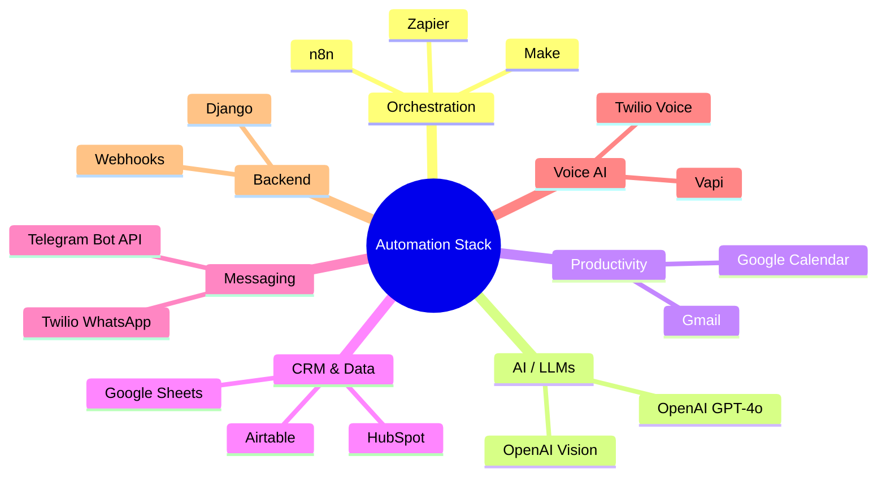

# Evance Chapuma — AI Automation Portfolio

[](https://www.upwork.com/freelancers/evancechapuma)
[](https://n8n.io)
[](https://www.make.com)
[](https://zapier.com)
[](https://openai.com)
[](https://www.twilio.com)
[](https://www.hubspot.com)
[](https://www.djangoproject.com)

---

> **I build AI-powered automation systems that save businesses 10–40 hours per week** — from intelligent voice agents that book appointments, to WhatsApp bots that qualify leads, to multi-agent workflows that run entire business processes on autopilot.

---

## About Me

I'm **Evance Chapuma**, a freelance AI automation specialist with hands-on experience designing and deploying production-grade automation systems for clients across real estate, e-commerce, customer support, and event management.

My core stack spans **n8n**, **Make (Integromat)**, **Zapier**, **Vapi** (voice AI), **HubSpot**, **WhatsApp/Twilio**, and **Django** — with AI agents powered by **OpenAI GPT-4o** and **Claude**.

I don't just connect APIs. I design systems that handle edge cases, fail gracefully, and scale with your business.

📬 **Available for hire:** [Upwork Profile](https://www.upwork.com/freelancers/evancechapuma)

---

## Projects

| # | Project | Description | Stack | Folder |
|---|---------|-------------|-------|--------|
| 01 | [Google Review Responder](#01-google-review-responder) | Multi-agent system that auto-responds to Google Reviews with sentiment-aware messaging | n8n · OpenAI · Google Maps API | [→](./projects/01-google-review-responder/) |
| 02 | [WhatsApp Lead Agent](#02-whatsapp-lead-agent) | Conversational AI agent that qualifies inbound leads via WhatsApp | n8n · Twilio · OpenAI | [→](./projects/02-whatsapp-lead-agent/) |
| 03 | [Vapi Real Estate Booking Agent](#03-vapi-real-estate-booking-agent) | Voice AI agent that handles property inquiries and books viewings | Vapi · n8n · Google Calendar | [→](./projects/03-vapi-real-estate-booking/) |
| 04 | [Vapi Customer Support Agent](#04-vapi-customer-support-agent) | Voice AI agent that handles Tier-1 support calls with FAQ resolution | Vapi · n8n · OpenAI | [→](./projects/04-vapi-customer-support/) |
| 05 | [Multi-Agent Personal Assistant](#05-multi-agent-personal-assistant) | Orchestrated AI assistant managing email, calendar, CRM, and messaging | n8n · HubSpot · Gmail · Telegram | [→](./projects/05-multi-agent-personal-assistant/) |
| 06 | [WhatsApp Event Registration System](#06-whatsapp-event-registration-system) | End-to-end event registration via WhatsApp: PDF ingestion, payment verification, seat assignment | n8n · Airtable · Twilio · OpenAI Vision | [→](./projects/06-whatsapp-event-registration/) |

---

## Project Highlights

### 01 — Google Review Responder

A production n8n multi-agent system that monitors Google My Business for new reviews and automatically crafts professional responses. It routes reviews through a **Text Classifier agent** to detect sentiment, then dispatches to either a **Positive Review agent** or **Negative Review agent**. A **Revision agent** performs a final quality check before posting.

**Impact:** Zero manual review management. Every review gets a response within 5 minutes, 24/7.

[View project →](./projects/01-google-review-responder/)

---

### 02 — WhatsApp Lead Agent

An n8n workflow that connects to a Twilio WhatsApp number and runs a conversational AI lead qualification flow. The agent asks structured discovery questions, scores the lead, and either books a call or routes to a CRM pipeline — all within a WhatsApp thread.

**Impact:** Qualifies inbound leads instantly without a human sales rep.

[View project →](./projects/02-whatsapp-lead-agent/)

---

### 03 — Vapi Real Estate Booking Agent

**Stevenson** — a voice AI agent built on Vapi for Maplecrest Realty. Handles inbound property inquiries over the phone: answers questions about listings, captures prospect details via structured data extraction, and books property viewings directly into the agent's calendar via an n8n webhook.

**Impact:** A always-on receptionist that converts cold calls into booked viewings.

[View project →](./projects/03-vapi-real-estate-booking/)

---

### 04 — Vapi Customer Support Agent

**Alex** — a voice AI customer support agent built on Vapi for CreekSoftware. Handles inbound support calls, resolves Tier-1 issues using a dynamic FAQ knowledge base, and escalates complex cases to human agents with a full call summary.

**Impact:** Deflects 60–70% of support calls without human intervention.

[View project →](./projects/04-vapi-customer-support/)

---

### 05 — Multi-Agent Personal Assistant

A sophisticated n8n orchestration system with specialized sub-agents for email triage (Gmail), calendar management (Google Calendar), CRM updates (HubSpot), SMS alerts (Twilio), and Telegram command handling. A central router agent interprets natural language requests and delegates to the right sub-agent.

**Impact:** A fully automated executive assistant that runs 24/7.

[View project →](./projects/05-multi-agent-personal-assistant/)

---

### 06 — WhatsApp Event Registration System

A complete event management pipeline over WhatsApp. Ingests event details from a PDF, runs a conversational registration flow, verifies payment screenshots using **OpenAI Vision**, assigns bus seats from an Airtable inventory, and sends automated reminders before the event.

**Impact:** Replaces a manual registration desk with a fully automated system handling hundreds of attendees.

[View project →](./projects/06-whatsapp-event-registration/)

---

## Tech Stack Overview



---

## Repository Structure

```
automation-portfolio/
├── projects/
│   ├── 01-google-review-responder/
│   ├── 02-whatsapp-lead-agent/
│   ├── 03-vapi-real-estate-booking/
│   ├── 04-vapi-customer-support/
│   ├── 05-multi-agent-personal-assistant/
│   └── 06-whatsapp-event-registration/
├── templates/
│   └── workflow-readme-template.md
├── .github/
│   ├── CONTRIBUTING.md
│   └── ISSUE_TEMPLATE/bug_report.md
└── LICENSE
```

---

## License

MIT — see [LICENSE](./LICENSE) for details.

---

*Built with care by [Evance Chapuma](https://www.upwork.com/freelancers/evancechapuma)*
