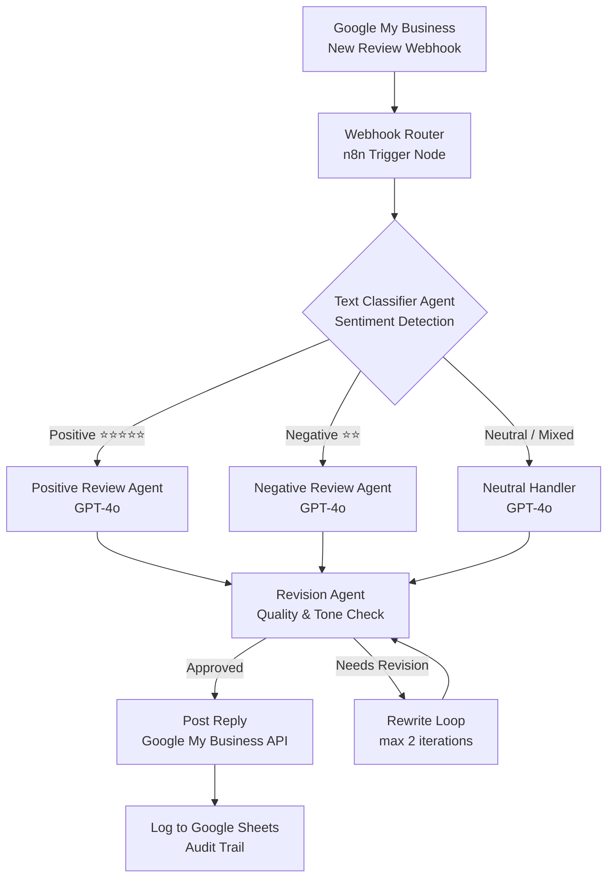
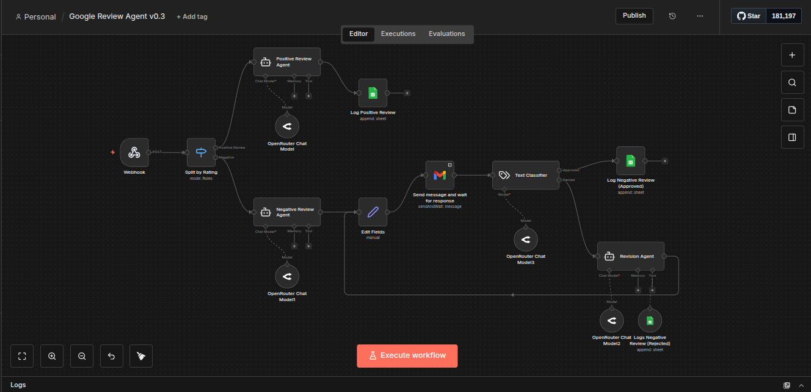

# Google Review Responder — Multi-Agent System


> **Automatically respond to every Google Review within minutes — with AI-crafted replies tailored to sentiment, tone, and context.**

---

## Overview

This n8n multi-agent workflow monitors your Google My Business listing for new reviews and generates professional, personalized responses automatically. It classifies each review by sentiment, routes it to a specialized AI agent, and posts the reply — all without human intervention.

No two responses are identical. The system understands context, mirrors the customer's tone, and follows best practices for review management to protect and enhance your online reputation.

---

## Use Case

**Who uses this?**
Restaurant owners, hotel managers, retail stores, clinics — any business that receives Google Reviews and wants to respond consistently without dedicating staff time to it.

**Problem it solves:**
Manually responding to Google Reviews is slow, inconsistent, and often skipped when teams are busy. Unanswered negative reviews signal neglect to prospective customers. Positive reviews with no reply miss an opportunity to reinforce loyalty.

**Result:**
Every review — positive or negative — receives a tailored, professional response within 5 minutes, 24/7. Negative reviews are handled with empathy and a path to resolution. Positive reviews amplify goodwill.

---

## Architecture



---

## Tech Stack

| Tool | Role |
|------|------|
| **n8n** | Workflow orchestration and agent routing |
| **OpenAI GPT-4o** | Text classification, response generation, revision |
| **Google My Business API** | Fetching new reviews and posting replies |
| **Google Maps API** | Place ID resolution and business metadata |
| **Google Sheets** | Audit log of all reviews and responses |
| **n8n Webhook** | Entry point for review event triggers |

---

## Agent Breakdown

| Agent | Responsibility |
|-------|---------------|
| **Text Classifier** | Detects sentiment (positive / negative / neutral / mixed) and extracts key themes from the review text |
| **Positive Review Agent** | Crafts warm, brand-appropriate thank-you responses that encourage return visits |
| **Negative Review Agent** | Responds with empathy, acknowledges the issue, offers a resolution path, and avoids defensiveness |
| **Revision Agent** | Reviews the draft for tone, length, grammar, and brand consistency before posting |

---

## Setup Instructions

> **Prerequisites:** n8n instance (cloud or self-hosted), Google Cloud project with My Business API enabled, OpenAI API key.

1. **Clone this repository**
   ```bash
   git clone https://github.com/evance626/automation-portfolio.git
   cd automation-portfolio/projects/01-google-review-responder
   ```

2. **Copy environment variables**
   ```bash
   cp .env.example .env
   # Fill in all placeholder values
   ```

3. **Enable Google My Business API**
   - Go to [Google Cloud Console](https://console.cloud.google.com)
   - Enable **My Business Account Management API** and **My Business Reviews API**
   - Create an OAuth 2.0 credential and download the JSON
   - Find your `GOOGLE_PLACE_ID` via the Google Maps Places API

4. **Import the workflow into n8n**
   - Open n8n → Workflows → Import from file
   - Upload `workflow.json` from this folder
   - Connect your Google OAuth credential and OpenAI API key in the credential manager

5. **Configure the webhook**
   - Copy the webhook URL from the Trigger node
   - Register it as a notification endpoint in your Google My Business API setup

6. **Test**
   - Send a test POST to your webhook URL with a sample review payload
   - Check the n8n execution log to trace the agent routing

---

## Environment Variables

| Variable | Description |
|----------|-------------|
| `N8N_WEBHOOK_URL` | Your n8n webhook endpoint URL |
| `OPENAI_API_KEY` | OpenAI API key (GPT-4o access required) |
| `GOOGLE_MAPS_API_KEY` | Google Maps/Places API key |
| `GOOGLE_PLACE_ID` | Your business's Google Place ID |
| `GOOGLE_CLIENT_ID` | OAuth 2.0 client ID for Google My Business |
| `GOOGLE_CLIENT_SECRET` | OAuth 2.0 client secret |
| `GOOGLE_REFRESH_TOKEN` | OAuth refresh token for long-lived access |
| `AUDIT_SHEET_ID` | Google Sheets ID for the audit log |

See [.env.example](.env.example) for placeholder values.

---

## Workflow Preview



---

## Key Design Decisions

**Why a multi-agent architecture instead of a single prompt?**
A single monolithic prompt trying to classify AND respond AND revise leads to inconsistent outputs. Separating concerns into specialized agents (classifier → writer → reviser) produces higher-quality responses and makes each stage independently testable and tuneable.

**Why a Revision Agent?**
LLMs occasionally produce responses that are too long, too apologetic, or off-brand. The Revision Agent acts as an editor — it catches these issues before the reply goes live, with a maximum of 2 rewrite iterations to prevent infinite loops.

**How is the classification handled?**
The Text Classifier agent uses a structured output prompt that returns a JSON object with `sentiment`, `themes[]`, and `urgency` fields. This structured output drives the webhook router's branching logic deterministically.

**Audit trail:**
Every review and its generated response are logged to Google Sheets with timestamps, star rating, sentiment classification, and revision count — enabling performance analysis and human spot-checking.

---

## License

MIT — see [LICENSE](../../LICENSE) for details.

---

*Built by [Evance Chapuma](https://www.upwork.com/freelancers/evancechapuma) — AI Automation Specialist*
