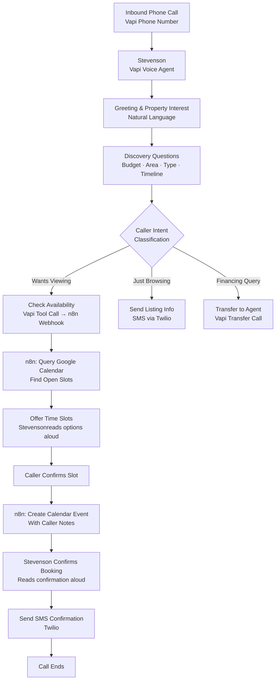

# Vapi Real Estate Booking Agent — Stevenson at Maplecrest Realty


> **Meet Stevenson — Maplecrest Realty's AI receptionist who answers property inquiries, qualifies buyers, and books viewings automatically over the phone.**

---

## Overview

Stevenson is a voice AI agent built on [Vapi](https://vapi.ai) for a fictional real estate agency — Maplecrest Realty. He handles inbound property inquiry calls with a natural, professional voice, answers questions about listings, extracts structured buyer information (budget, timeline, preferred area, property type), and books property viewings directly into the agent's Google Calendar — all via a real-time n8n webhook integration.

This system replaces a human receptionist for all Tier-1 inquiry calls, freeing agents to focus exclusively on in-person meetings and closings.

---

## Use Case

**Who uses this?**
Real estate agencies, independent agents, and property management companies that receive high volumes of inbound inquiry calls and want to qualify prospects and book viewings without phone tag or missed calls.

**Problem it solves:**
Real estate agents miss calls constantly — during showings, negotiations, or after hours. Every missed call is a potential lost commission. Hiring a receptionist is expensive and doesn't scale with call volume.

**Result:**
Stevenson answers 100% of inbound calls, qualifies every caller in under 3 minutes, and books viewings that appear instantly in the agent's calendar — with full caller notes attached. Agents arrive at every showing prepared.

---

## Architecture



---

## Tech Stack

| Tool | Role |
|------|------|
| **Vapi** | Voice AI platform — telephony, STT, TTS, LLM orchestration |
| **OpenAI GPT-4o** | Language model powering Stevenson's responses |
| **n8n** | Backend webhook handler for calendar and data operations |
| **Google Calendar API** | Availability checking and event creation |
| **Twilio** | SMS confirmation delivery |
| **Google Sheets** | Lead log — all callers and outcomes recorded |

---

## Vapi Configuration

Stevenson is configured with the following Vapi settings:

| Parameter | Value |
|-----------|-------|
| **Voice** | ElevenLabs — Adam (warm, professional) |
| **First Message** | *"Thank you for calling Maplecrest Realty! This is Stevenson. How can I help you today?"* |
| **End Call Phrases** | *"Have a great day", "Talk soon", "Goodbye"* |
| **Max Duration** | 10 minutes |
| **Background Sound** | Office ambience |
| **Structured Data Extraction** | `budget`, `preferred_area`, `property_type`, `timeline`, `caller_name`, `caller_phone` |

### Tool Calls (n8n Webhooks)

| Tool | Trigger | n8n Action |
|------|---------|-----------|
| `check_availability` | Caller wants to book a viewing | Query Google Calendar for open slots |
| `create_booking` | Caller confirms a slot | Create calendar event with notes |
| `send_listing_sms` | Caller wants listing details | Send SMS via Twilio with property link |

---

## Setup Instructions

> **Prerequisites:** Vapi account, n8n instance, Google Cloud project with Calendar API, Twilio account.

1. **Clone this repository**
   ```bash
   git clone https://github.com/evancechapuma/automation-portfolio.git
   cd automation-portfolio/projects/03-vapi-real-estate-booking
   ```

2. **Configure n8n webhooks**
   - Import `workflow.json` into your n8n instance
   - Copy the webhook URLs for `check_availability`, `create_booking`, and `send_listing_sms`

3. **Set up Google Calendar API**
   - Enable Calendar API in Google Cloud Console
   - Create a Service Account and download the JSON key
   - Share the target calendar with the service account email

4. **Configure Vapi**
   - Log in to [Vapi Dashboard](https://dashboard.vapi.ai)
   - Create a new Assistant named "Stevenson"
   - Set the system prompt (see `vapi-system-prompt.md` in this folder)
   - Add the three tool calls with your n8n webhook URLs
   - Attach a phone number to the assistant

5. **Copy environment variables**
   ```bash
   cp .env.example .env
   # Fill in all values
   ```

6. **Test**
   - Call your Vapi phone number
   - Say: *"Hi, I'm interested in a 3-bedroom property in the north end, budget around $400,000"*
   - Verify the booking appears in Google Calendar

---

## Environment Variables

| Variable | Description |
|----------|-------------|
| `VAPI_API_KEY` | Vapi API key from dashboard |
| `VAPI_PHONE_NUMBER_ID` | ID of the Vapi phone number assigned to Stevenson |
| `N8N_WEBHOOK_URL_AVAILABILITY` | n8n webhook for `check_availability` tool |
| `N8N_WEBHOOK_URL_BOOKING` | n8n webhook for `create_booking` tool |
| `N8N_WEBHOOK_URL_SMS` | n8n webhook for `send_listing_sms` tool |
| `GOOGLE_SERVICE_ACCOUNT_EMAIL` | Service account email for Calendar API |
| `GOOGLE_SERVICE_ACCOUNT_KEY` | Base64-encoded service account JSON key |
| `GOOGLE_CALENDAR_ID` | Target calendar ID (usually an email address) |
| `TWILIO_ACCOUNT_SID` | Twilio Account SID |
| `TWILIO_AUTH_TOKEN` | Twilio Auth Token |
| `TWILIO_PHONE_NUMBER` | Twilio SMS sender number |
| `LEAD_SHEET_ID` | Google Sheets ID for lead logging |

See [.env.example](.env.example) for placeholder values.

---

## Key Design Decisions

**Why Vapi over building directly on Twilio + Whisper?**
Vapi handles the full real-time voice stack — STT, LLM turn-taking, TTS, interruption handling, and telephony — out of the box. Building this natively would require significant infrastructure. Vapi lets us focus on the conversation design and business logic.

**How does structured data extraction work?**
Vapi's built-in extraction schema captures `caller_name`, `budget`, `preferred_area`, `property_type`, and `timeline` from the natural conversation. This JSON is delivered to n8n at call end via a webhook, populating the lead log automatically — no manual data entry.

**How is calendar double-booking prevented?**
The `check_availability` tool queries Google Calendar for busy/free blocks across a 5-day window before offering slots. n8n creates the event with a 15-minute buffer on each side, and calendar conflict detection is enabled at the Google Calendar API level.

**What happens if the caller is hostile or confused?**
Stevenson's system prompt includes escalation instructions: after two failed clarification attempts, he offers to transfer the call to a human agent using Vapi's native call transfer feature.

---

## Screenshots

A couple of representative screenshots from the project (click to view full size).

<p align="center">
</p>

<p align="center">
   <a href="screenshots/bookingConfirmation.png"></a>
   <a href="screenshots/vapiDash.png"></a>
</p>
</p>


## License

MIT — see [LICENSE](../../LICENSE) for details.

---

*Built by [Evance Chapuma](https://www.upwork.com/freelancers/evancechapuma) — AI Automation Specialist*
