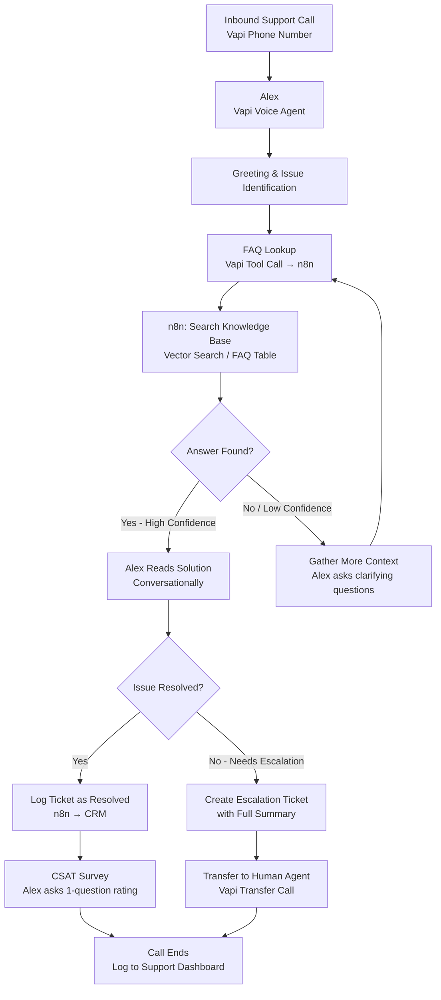

# Vapi Customer Support Agent — Alex at CreekSoftware


> **Meet Alex — CreekSoftware's AI support agent who resolves Tier-1 issues instantly, escalates intelligently, and never puts a customer on hold.**

---

## Overview

Alex is a voice AI customer support agent built on [Vapi](https://vapi.ai) for CreekSoftware (a fictional SaaS company). Alex handles inbound support calls, resolves common issues using a dynamic FAQ knowledge base fetched in real time via n8n, logs tickets, and escalates complex cases to human agents with a complete call summary — so the customer never has to repeat themselves.

The system is designed to deflect 60–70% of Tier-1 support calls without human intervention, dramatically reducing support team workload and improving response times.

---

## Use Case

**Who uses this?**
SaaS companies, software businesses, and tech startups with a support phone line that handles repetitive, answerable questions — password resets, billing inquiries, feature how-tos, and common error resolutions.

**Problem it solves:**
Support teams spend the majority of their time on questions that have known answers. Every minute a rep spends on a Tier-1 call is a minute they're not solving complex issues. Long hold times frustrate customers and increase churn.

**Result:**
Alex handles the full Tier-1 queue instantly — no hold times, no wait. When escalation is needed, human agents receive a complete briefing before they pick up the phone. Average call resolution time drops significantly.

---

## Architecture



---

## Tech Stack

| Tool | Role |
|------|------|
| **Vapi** | Voice AI platform — real-time telephony, STT, TTS |
| **OpenAI GPT-4o** | Language model powering Alex's responses |
| **n8n** | FAQ retrieval, ticket logging, escalation routing |
| **Airtable / Notion** | FAQ knowledge base storage |
| **HubSpot / Zendesk** | Support ticket creation and CRM sync |
| **Twilio** | Call transfer and SMS follow-ups |

---

## Vapi Configuration

Alex is configured with the following Vapi settings:

| Parameter | Value |
|-----------|-------|
| **Voice** | ElevenLabs — Rachel (clear, friendly, professional) |
| **First Message** | *"Thanks for calling CreekSoftware support! I'm Alex. Can I get your name and account email to pull up your account?"* |
| **End Call Phrases** | *"Is there anything else I can help with?", "Have a great day!"* |
| **Max Duration** | 15 minutes |
| **CSAT Collection** | Enabled — 1-question scale before call end |
| **Call Recording** | Enabled (with caller consent prompt) |

### Tool Calls (n8n Webhooks)

| Tool | Trigger | n8n Action |
|------|---------|-----------|
| `lookup_faq` | Alex needs to answer a question | Search FAQ knowledge base, return top match |
| `lookup_account` | Caller provides email | Fetch account details from CRM |
| `create_ticket` | Issue logged | Create support ticket in HubSpot/Zendesk |
| `escalate_call` | Human handoff needed | Create escalation record with full summary |

---

## FAQ Knowledge Base Design

The knowledge base is stored in Airtable with the following schema:

| Field | Type | Description |
|-------|------|-------------|
| `question` | Text | The FAQ question (used for search) |
| `answer` | Long Text | The resolution steps |
| `category` | Select | billing / login / features / errors / other |
| `tier` | Number | 1 = AI can resolve, 2 = human required |
| `keywords` | Text | Comma-separated search terms |

Alex's `lookup_faq` tool call sends the caller's described issue to n8n, which performs a keyword + semantic search and returns the top match with confidence score. Only Tier-1 answers are surfaced to Alex.

---

## Setup Instructions

> **Prerequisites:** Vapi account, n8n instance, Airtable account, HubSpot or Zendesk account.

1. **Clone this repository**
   ```bash
   git clone https://github.com/evance262/automation-portfolio.git
   cd automation-portfolio/projects/04-vapi-customer-support
   ```

2. **Set up the FAQ knowledge base**
   - Create an Airtable base with the schema above
   - Populate it with your product's FAQs

3. **Configure n8n webhooks**
   - Import `workflow.json` into n8n
   - Copy webhook URLs for each tool call endpoint

4. **Configure Vapi**
   - Create a new Assistant named "Alex" in [Vapi Dashboard](https://dashboard.vapi.ai)
   - Set the system prompt (see `vapi-system-prompt.md`)
   - Add all four tool calls with your n8n webhook URLs
   - Attach a phone number

5. **Copy environment variables**
   ```bash
   cp .env.example .env
   # Fill in all values
   ```

6. **Test**
   - Call your Vapi number
   - Say: *"Hi, I can't log into my account"*
   - Verify Alex looks up the FAQ, provides the resolution steps, and logs a ticket

---

## Environment Variables

| Variable | Description |
|----------|-------------|
| `VAPI_API_KEY` | Vapi API key |
| `VAPI_PHONE_NUMBER_ID` | Vapi phone number ID assigned to Alex |
| `N8N_WEBHOOK_URL_FAQ` | Webhook for `lookup_faq` tool |
| `N8N_WEBHOOK_URL_ACCOUNT` | Webhook for `lookup_account` tool |
| `N8N_WEBHOOK_URL_TICKET` | Webhook for `create_ticket` tool |
| `N8N_WEBHOOK_URL_ESCALATE` | Webhook for `escalate_call` tool |
| `AIRTABLE_API_KEY` | Airtable personal access token |
| `AIRTABLE_BASE_ID` | Airtable base ID for the FAQ database |
| `AIRTABLE_FAQ_TABLE` | Table name for FAQs |
| `HUBSPOT_API_KEY` | HubSpot private app token |
| `CREEKSOFTWARE_CRM_ENDPOINT` | CRM account lookup endpoint |

See [.env.example](.env.example) for placeholder values.

---

## Key Design Decisions

**Why a dynamic FAQ lookup instead of baking FAQs into the system prompt?**
A static system prompt becomes stale as the product evolves and hits Vapi's token limits. A live lookup against Airtable means the knowledge base can be updated by non-technical support staff without touching the AI configuration. It also enables confidence scoring — Alex only answers when the match score exceeds a threshold.

**How is call escalation handled seamlessly?**
When escalation is triggered, n8n generates a structured summary (issue, account details, steps already tried, CSAT so far) and creates a ticket before Vapi transfers the call. The receiving human agent sees the full context before saying "hello" — eliminating the need for the customer to repeat themselves.

**What prevents Alex from hallucinating support answers?**
Alex's system prompt explicitly instructs: *"Never guess or fabricate answers. If the FAQ lookup returns no confident match, say: 'Let me connect you with a specialist who can help with that specifically.'"* The tool call confidence threshold enforces this at the workflow level.

---

## License

MIT — see [LICENSE](../../LICENSE) for details.

---

*Built by [Evance Chapuma](https://www.upwork.com/freelancers/evancechapuma) — AI Automation Specialist*
