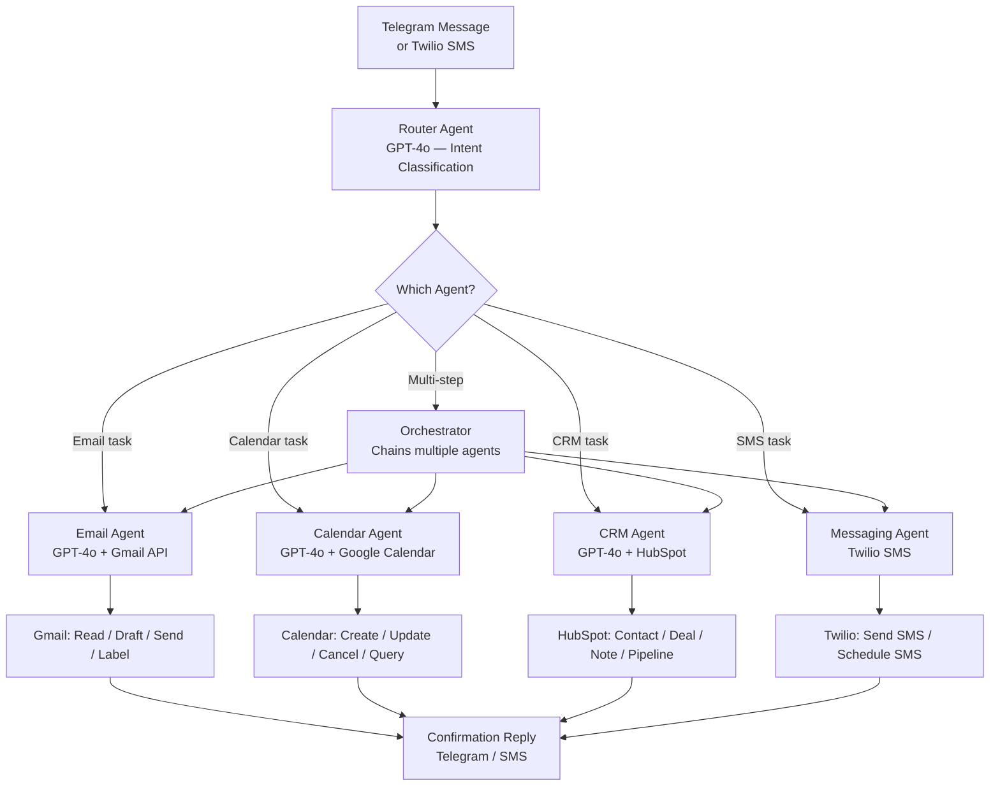

# Multi-Agent Personal Assistant


> **A fully orchestrated AI assistant that manages your inbox, calendar, CRM, and messages — all from a single Telegram command.**

---

## Overview

This n8n multi-agent system acts as a comprehensive personal assistant for busy professionals and business owners. It connects Gmail, Google Calendar, HubSpot CRM, Twilio SMS, and Telegram into a single orchestrated system, with specialized AI sub-agents for each domain.

A central **Router Agent** interprets natural language commands received via Telegram (or SMS) and delegates to the appropriate specialist: the **Email Agent** drafts and triages Gmail, the **Calendar Agent** manages meetings, the **CRM Agent** updates HubSpot contacts and pipelines, and the **Messaging Agent** dispatches Twilio SMS alerts.

---

## Use Case

**Who uses this?**
Entrepreneurs, consultants, and business owners who manage high email/meeting volume and want an AI assistant that understands context — not just keyword triggers.

**Problem it solves:**
Disconnected tools create constant context-switching. Reading emails, updating a CRM, scheduling meetings, and sending follow-up texts all happen in different apps. Each task is small, but together they consume hours per day.

**Result:**
Send one Telegram message: *"Reschedule tomorrow's 2pm call with Sarah to Thursday, and send her a text to let her know."* The assistant reads your calendar, finds the conflict, moves the event, finds Sarah's number in HubSpot, and texts her — all automatically.

---

## Architecture



---

## Tech Stack

| Tool | Role |
|------|------|
| **n8n** | Workflow orchestration and agent routing |
| **OpenAI GPT-4o** | Router, email drafting, calendar reasoning, CRM updates |
| **Gmail API** | Email read, draft, send, label, and search |
| **Google Calendar API** | Event creation, update, cancellation, free/busy lookup |
| **HubSpot** | Contact lookup, deal updates, note creation, pipeline management |
| **Twilio** | Outbound SMS — confirmations and alerts |
| **Telegram Bot API** | Primary command interface (with inline keyboard support) |

---

## Agent Breakdown

### Router Agent
Classifies incoming commands by domain and extracts structured intent. Returns a JSON routing decision like:
```json
{
  "agent": "calendar",
  "action": "reschedule",
  "entities": {
    "contact": "Sarah",
    "from_time": "tomorrow 2pm",
    "to_time": "Thursday"
  },
  "requires_chain": ["messaging"]
}
```

### Email Agent
- Triages inbox by priority (urgent / important / low)
- Drafts replies in your writing style (learned from past emails)
- Searches Gmail by contact, date range, or keyword
- Applies labels and archives automatically

### Calendar Agent
- Creates, updates, cancels, and queries events
- Checks availability before scheduling
- Handles recurring events and timezone conversion
- Sends meeting invitations via Google Calendar

### CRM Agent
- Creates and updates HubSpot contacts from conversation context
- Logs call notes and email summaries as HubSpot notes
- Moves deals through pipeline stages
- Fetches contact history for context before calls

### Messaging Agent
- Sends immediate or scheduled SMS via Twilio
- Drafts WhatsApp messages (optional Twilio WhatsApp integration)
- Formats messages appropriately for SMS length limits

---

## Sample Commands

| Command | Agent(s) Used | Action |
|---------|--------------|--------|
| *"What's on my calendar tomorrow?"* | Calendar | Returns schedule |
| *"Draft a follow-up email to Marcus from our meeting"* | Email + CRM | Fetches HubSpot note, drafts email |
| *"Schedule a 30-min call with Lisa next Tuesday at 10am"* | Calendar + CRM | Creates event, looks up Lisa in HubSpot |
| *"Mark the Johnson deal as closed-won"* | CRM | Updates HubSpot deal stage |
| *"Text all leads I spoke to this week"* | CRM + Messaging | Fetches recent contacts, sends SMS |
| *"Summarize my unread emails"* | Email | Returns priority-sorted summary |

---

## Setup Instructions

> **Prerequisites:** n8n instance, Google Cloud project (Gmail + Calendar APIs), HubSpot account, Twilio account, Telegram bot.

1. **Clone this repository**
   ```bash
   git clone https://github.com/evance262/automation-portfolio.git
   cd automation-portfolio/projects/05-multi-agent-personal-assistant
   ```

2. **Create a Telegram bot**
   - Message [@BotFather](https://t.me/botfather) on Telegram
   - Run `/newbot` and follow the prompts
   - Copy the bot token to `TELEGRAM_BOT_TOKEN`

3. **Enable Google APIs**
   - Enable Gmail API and Google Calendar API in Google Cloud Console
   - Create OAuth 2.0 credentials with the required scopes
   - Complete the OAuth flow to get a refresh token

4. **Configure n8n**
   - Import `workflow.json` into n8n
   - Connect all credentials: Google OAuth, HubSpot, Twilio, Telegram

5. **Set the Telegram webhook**
   - n8n will automatically register the webhook when you activate the workflow
   - Or manually: `https://api.telegram.org/botYOUR_TOKEN/setWebhook?url=YOUR_N8N_WEBHOOK`

6. **Copy environment variables**
   ```bash
   cp .env.example .env
   # Fill in all values
   ```

7. **Test**
   - Open Telegram, message your bot: *"What meetings do I have today?"*
   - Verify the Calendar Agent responds with your schedule

---

## Environment Variables

| Variable | Description |
|----------|-------------|
| `N8N_WEBHOOK_URL` | n8n Telegram webhook URL |
| `OPENAI_API_KEY` | OpenAI API key (GPT-4o) |
| `HUBSPOT_API_KEY` | HubSpot private app token |
| `GMAIL_CLIENT_ID` | Google OAuth client ID |
| `GMAIL_CLIENT_SECRET` | Google OAuth client secret |
| `GMAIL_REFRESH_TOKEN` | OAuth refresh token for Gmail |
| `GOOGLE_CALENDAR_ID` | Primary Google Calendar ID |
| `GOOGLE_CALENDAR_REFRESH_TOKEN` | OAuth refresh token for Calendar |
| `TWILIO_ACCOUNT_SID` | Twilio Account SID |
| `TWILIO_AUTH_TOKEN` | Twilio Auth Token |
| `TWILIO_PHONE_NUMBER` | Twilio SMS sender number |
| `TELEGRAM_BOT_TOKEN` | Telegram bot token from BotFather |
| `TELEGRAM_ALLOWED_USER_ID` | Your Telegram user ID (security whitelist) |

See [.env.example](.env.example) for placeholder values.

---

## Key Design Decisions

**Why Telegram as the command interface?**
Telegram bots support inline keyboards, file sending, and persistent chat history — making it a richer interface than SMS. It's also free and works globally. SMS via Twilio is supported as a fallback for when Telegram isn't available.

**How is multi-step orchestration handled?**
When the Router Agent detects a command that spans multiple domains (e.g., reschedule + notify), it returns a `requires_chain` array. n8n executes these agents sequentially, passing outputs as inputs to the next stage — creating a lightweight agent pipeline without a separate orchestration framework.

**Security: who can command the assistant?**
The `TELEGRAM_ALLOWED_USER_ID` whitelist ensures only your account can issue commands. Any message from an unrecognized user ID is silently dropped. This is a single-tenant system — multi-user support would require an authentication layer.

**How is writing style preserved in email drafts?**
The Email Agent's system prompt includes 3–5 example emails (written by the user) as few-shot examples. This trains the model to match tone, length, sign-off style, and vocabulary — without fine-tuning.

---

## License

MIT — see [LICENSE](../../LICENSE) for details.

---

*Built by [Evance Chapuma](https://www.upwork.com/freelancers/evancechapuma) — AI Automation Specialist*
