# WhatsApp Event Registration System


> **A complete event registration pipeline over WhatsApp — from PDF flyer to confirmed seat, with AI-verified payment and automated bus seat assignment.**

---

## Overview

This n8n system replaces a manual event registration desk with a fully automated WhatsApp-based pipeline. The workflow ingests event details from a PDF flyer, runs a guided conversational registration flow with each attendee via WhatsApp, verifies payment screenshots using OpenAI Vision (GPT-4o with image input), assigns bus seats from an Airtable inventory, and sends automated reminders before the event day.

It handles hundreds of attendees simultaneously — something a human registration team simply cannot do.

---

## Use Case

**Who uses this?**
Event organizers, churches, schools, community organizations, and corporate event planners who need to collect registrations, verify payments, and manage logistics (like transport seating) — primarily through WhatsApp, where their audience already is.

**Problem it solves:**
Manual event registration is chaotic: attendees send payments to different numbers, confirmations get lost, seat assignments are done in spreadsheets by hand, and reminders require someone to message hundreds of people individually. Errors are common and the process doesn't scale.

**Result:**
An attendee messages your WhatsApp number, registers in a 5-message conversation, sends their payment screenshot, gets instant confirmation with their seat number, and receives automated reminders — all without any manual intervention from the organizer.

---

## Architecture

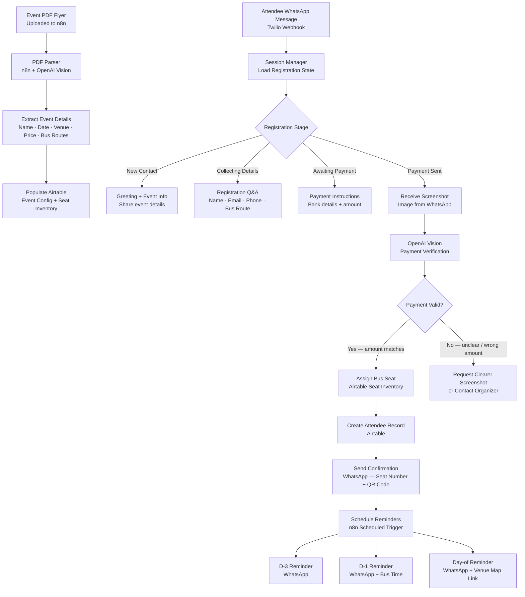

---

## Tech Stack

| Tool | Role |
|------|------|
| **n8n** | Full workflow orchestration and session management |
| **Twilio WhatsApp API** | Inbound/outbound WhatsApp messaging and media handling |
| **OpenAI GPT-4o** | Conversational registration flow and response generation |
| **OpenAI Vision (GPT-4o)** | Payment screenshot analysis and verification |
| **Airtable** | Event configuration, attendee records, seat inventory |
| **n8n Scheduled Trigger** | Automated reminder dispatch (D-3, D-1, Day-of) |

---

## Pipeline Stages

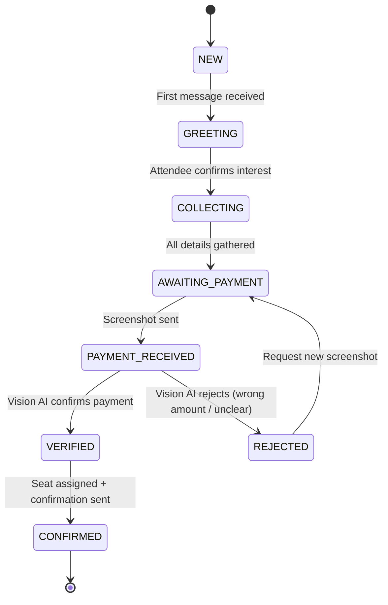

---

## PDF Ingestion Flow

When the event organizer uploads the event flyer PDF to n8n:

1. n8n extracts text and embedded images using the PDF parser node
2. OpenAI Vision reads the flyer and extracts structured JSON:
   ```json
   {
     "event_name": "Annual Youth Gala 2025",
     "date": "2025-08-15",
     "venue": "Civic Centre Hall, Lilongwe",
     "ticket_price": 5000,
     "currency": "MWK",
     "bus_routes": ["City Centre", "Area 25", "Kanengo"],
     "bus_departure_time": "17:00"
   }
   ```
3. n8n creates the event record in Airtable and pre-populates the seat inventory table

---

## Payment Verification via Vision AI

When an attendee sends a payment screenshot:

- The image is passed to GPT-4o Vision with a structured prompt
- The model extracts: `amount_paid`, `currency`, `reference_number`, `timestamp`, `sender_name`
- n8n compares `amount_paid` against the expected ticket price in Airtable
- If the amount matches (within a 5% tolerance for bank fees), the registration is confirmed
- If not, a friendly message requests clarification or a clearer image

---

## Seat Assignment Logic

Bus seats are pre-loaded in Airtable as rows with fields: `seat_number`, `bus_route`, `status` (available/reserved/confirmed). When payment is verified:

1. n8n queries Airtable for the first available seat on the attendee's chosen bus route
2. The seat is atomically marked as `reserved` (preventing race conditions on simultaneous registrations)
3. After confirmation is sent, the seat is marked `confirmed`

---

## Setup Instructions

> **Prerequisites:** n8n instance, Twilio WhatsApp number, Airtable account, OpenAI API key with Vision access.

1. **Clone this repository**
   ```bash
   git clone https://github.com/evancechapuma/automation-portfolio.git
   cd automation-portfolio/projects/06-whatsapp-event-registration
   ```

2. **Set up Airtable**
   - Create a base with three tables: `Events`, `Attendees`, `Seats`
   - Use the schema from `airtable-schema.md` in this folder

3. **Configure Twilio WhatsApp**
   - Set the Twilio webhook URL to your n8n webhook endpoint
   - Enable media handling (for screenshot receipt)

4. **Copy environment variables**
   ```bash
   cp .env.example .env
   # Fill in all values
   ```

5. **Import and activate the workflow**
   - Import `workflow.json` into n8n
   - Connect Twilio, OpenAI, and Airtable credentials

6. **Upload your first event PDF**
   - Trigger the PDF ingestion sub-workflow manually via n8n
   - Verify the event record appears in Airtable

7. **Test registration**
   - Message your Twilio WhatsApp number: *"Hi, I'd like to register for the event"*
   - Walk through the conversation flow to completion

---

## Environment Variables

| Variable | Description |
|----------|-------------|
| `TWILIO_ACCOUNT_SID` | Twilio Account SID |
| `TWILIO_AUTH_TOKEN` | Twilio Auth Token |
| `TWILIO_WHATSAPP_NUMBER` | Twilio WhatsApp sender number |
| `N8N_WEBHOOK_URL` | n8n webhook for inbound WhatsApp |
| `OPENAI_API_KEY` | OpenAI API key (Vision / GPT-4o access required) |
| `AIRTABLE_API_KEY` | Airtable personal access token |
| `AIRTABLE_BASE_ID` | Airtable base ID |
| `AIRTABLE_EVENTS_TABLE` | Table name for event records |
| `AIRTABLE_ATTENDEES_TABLE` | Table name for attendee records |
| `AIRTABLE_SEATS_TABLE` | Table name for seat inventory |
| `PAYMENT_TOLERANCE_PERCENT` | Tolerance for payment amount mismatch (default: 5) |

See [.env.example](.env.example) for placeholder values.

---

## Key Design Decisions

**Why WhatsApp for event registration?**
In many markets (Africa, Southeast Asia, Latin America), WhatsApp is the primary communication channel — not email or web forms. Meeting attendees where they are dramatically increases registration completion rates. No app download, no login — just a chat.

**Why OpenAI Vision for payment verification instead of manual confirmation?**
Manual payment verification requires a human to check screenshots one by one — impossible at scale and a bottleneck during registration peaks. Vision AI processes screenshots in seconds with high accuracy for common mobile banking apps (M-Pesa, bank transfers, etc.).

**How are race conditions handled for seat assignment?**
Airtable's API is not ACID-transactional, so simultaneous seat assignment requests could cause double-booking. The workflow uses an optimistic locking pattern: it reads and immediately updates the seat status to `reserved` in a single Airtable PATCH request, then validates the response before proceeding. For very high concurrency, a Redis-based lock via n8n's HTTP Request node would be the next step.

**How are reminders scheduled?**
n8n's Scheduled Trigger node runs daily and calculates the days until each event. Attendees with `status = confirmed` and 3 days or 1 day remaining get a WhatsApp reminder. Day-of reminders fire at a configured time (e.g. 7am). This avoids creating hundreds of individual scheduled jobs.

---

## Screenshots

A gallery of key workflow screens and n8n nodes from this project. Click any image to view the full-size screenshot.

<p align="center">
   <a href="screenshots/Intent.png">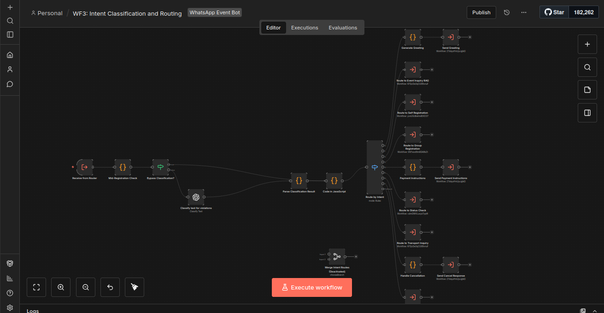</a>
   <a href="screenshots/eventInquiry.png">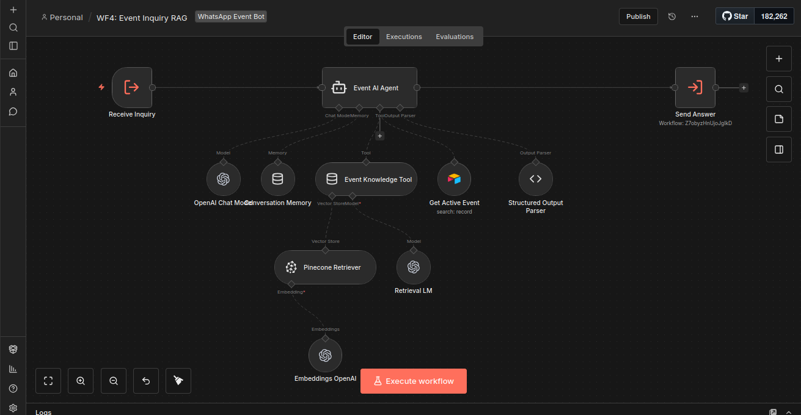</a>
   <a href="screenshots/eventSetup.png">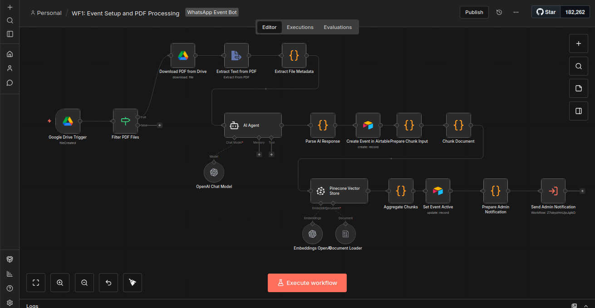</a>
</p>

<p align="center">
   <a href="screenshots/selfRegistration.png">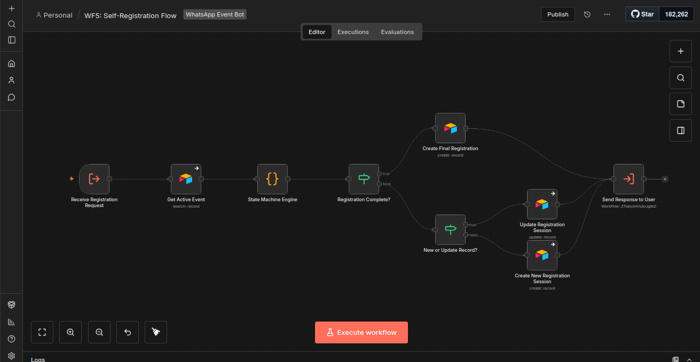</a>
   <a href="screenshots/groupRegistration.png">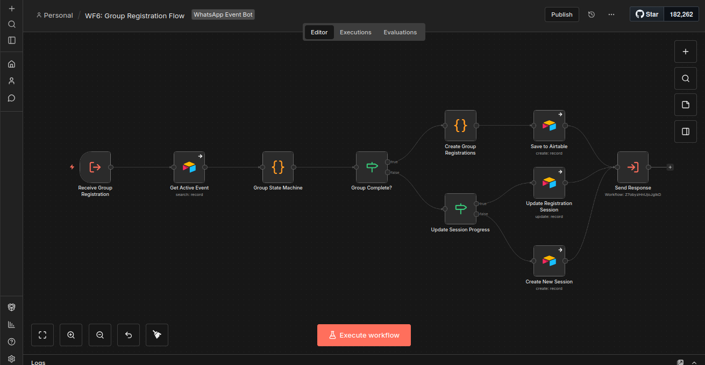</a>
   <a href="screenshots/paymentVerification.png">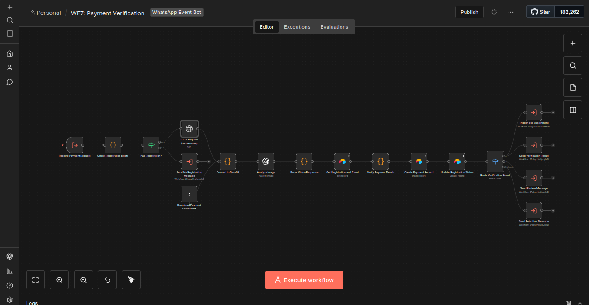</a>
</p>

<p align="center">
   <a href="screenshots/busAssignment.png">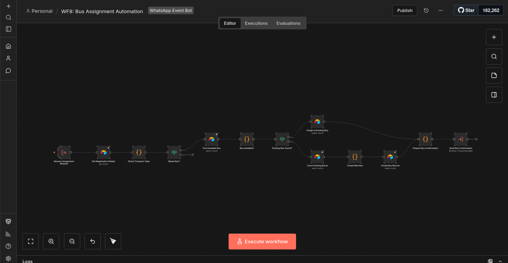</a>
   <a href="screenshots/reminders.png">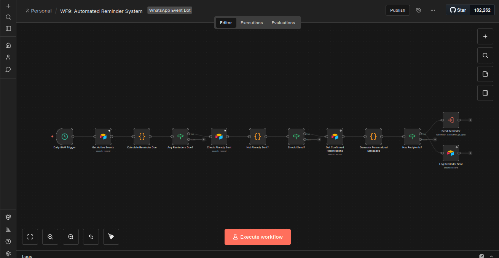</a>
   <a href="screenshots/adminStats.png">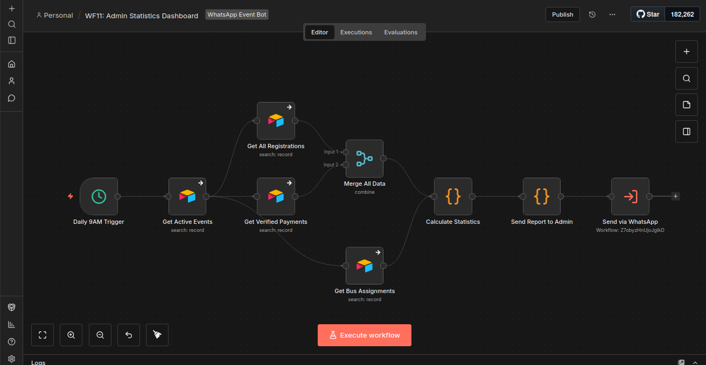</a>
</p>

<p align="center">
   <a href="screenshots/messageHandler.png">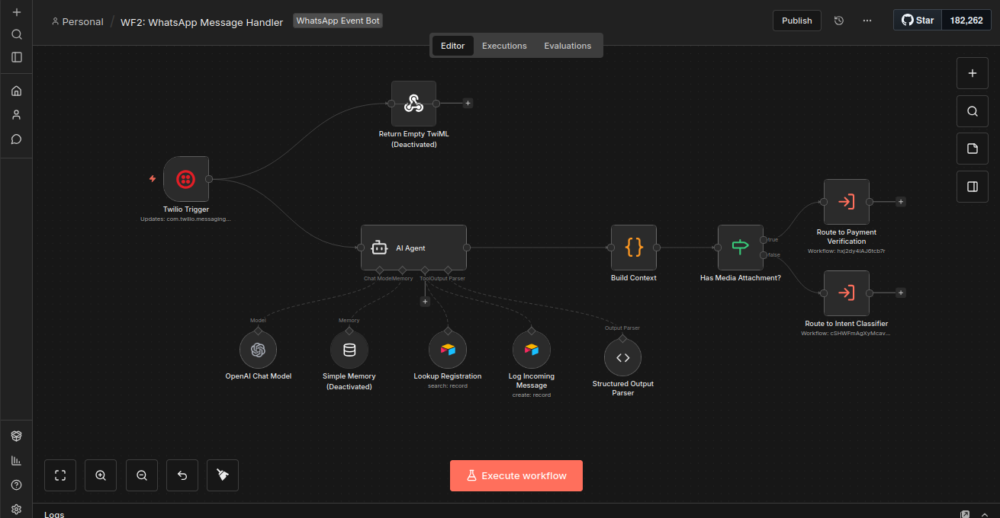</a>
   <a href="screenshots/statusChecker.png">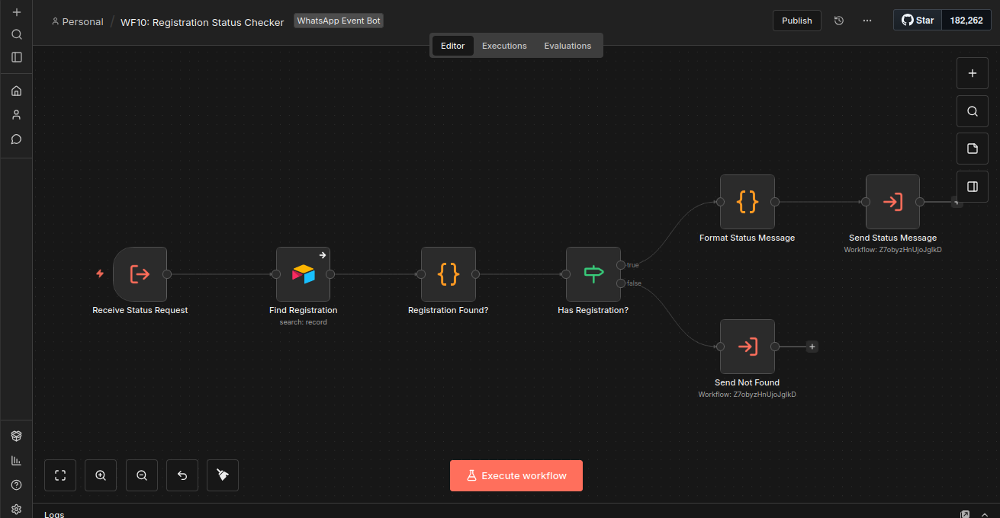</a>
   <a href="screenshots/sendHelper.png">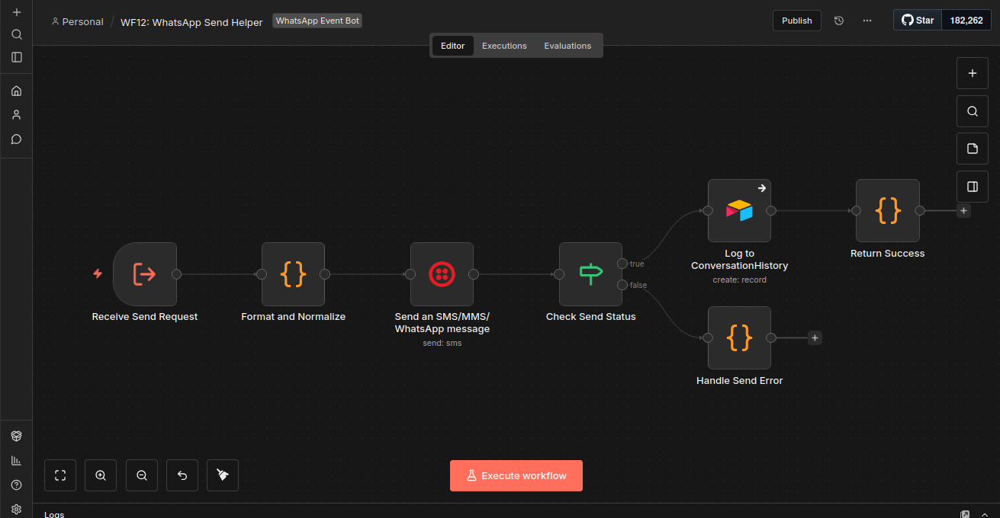</a>
</p>


## License

MIT — see [LICENSE](../../LICENSE) for details.

---

*Built by [Evance Chapuma](https://www.upwork.com/freelancers/evancechapuma) — AI Automation Specialist*
