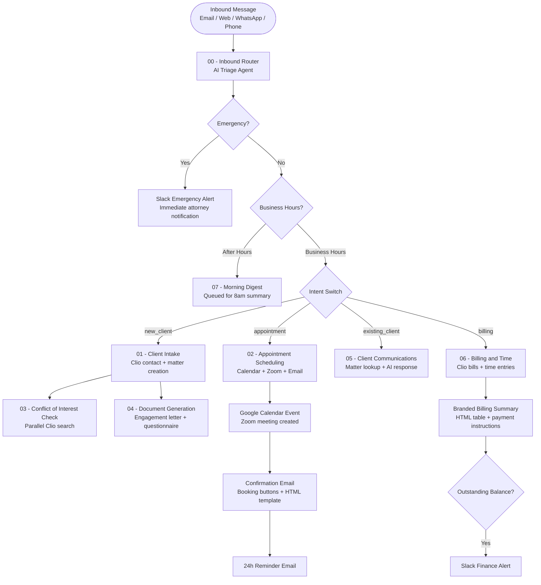

# AI Law Firm Receptionist — 8-Workflow Automation System


> **A fully autonomous AI receptionist for law firms — triages inbound enquiries, books consultations, runs conflict checks, generates client documents, handles billing questions, and sends a daily digest. All without human intervention.**

---

## Overview

This system replaces a law firm's front-desk reception function with an 8-workflow n8n automation stack. When a client contacts the firm — by email, web form, WhatsApp, or phone — the AI intake router classifies the enquiry, determines urgency, and dispatches it to the correct specialist sub-workflow.

Every client interaction produces a professional, branded HTML email response. Attorneys receive Slack alerts for emergencies and a morning digest summarising overnight activity. All client data flows in and out of Clio — the firm's practice management system.

---

## Use Case

**Who uses this?**
Small to mid-size law firms (2–20 attorneys) that receive high volumes of inbound enquiries and lack dedicated reception staff, or want to extend their availability beyond office hours.

**Problem it solves:**
Law firms routinely miss new client enquiries outside business hours, respond inconsistently to existing clients, and spend attorney time on administrative tasks like scheduling, document generation, and billing questions. Every missed enquiry is a lost case.

**Result:**
Every inbound message — at any hour — receives an immediate, professional response. New clients are onboarded into Clio within minutes. Consultations are scheduled and confirmed with Zoom links automatically. Attorneys see only what needs their attention.

---

## System Architecture



---

## Workflow Breakdown

| # | Workflow | Trigger | What it does |
|---|----------|---------|-------------|
| 00 | **Inbound Router** | Webhook (all channels) | AI triage: classifies intent, urgency, extracts name/email/phone, routes to sub-workflows |
| 01 | **Client Intake** | Sub-workflow | Searches Clio for existing contact, creates contact + matter if new, sends welcome email |
| 02 | **Appointment Scheduling** | Sub-workflow + GET webhook | Checks Google Calendar for free slots, sends clickable booking email, creates Zoom + Calendar event on click, sends confirmation + 24h reminder |
| 03 | **Conflict of Interest Check** | Sub-workflow | Parallel search of Clio contacts and matters for name/email matches, AI conflict analysis, Slack alert if conflict found |
| 04 | **Document Generation** | Sub-workflow | Generates branded engagement letter + intake questionnaire via Claude, sends both via Gmail |
| 05 | **Client Communications** | Sub-workflow | Looks up client's open matters in Clio, drafts contextual AI response, logs to Slack |
| 06 | **Billing & Time** | Sub-workflow | Fetches outstanding bills + time entries from Clio, generates HTML billing summary, Slack alert if balance outstanding |
| 07 | **Morning Digest** | Cron (8am weekdays) | Summarises overnight Gmail messages by urgency (High/Medium/Low), emails digest to intake@ address |

---

## Tech Stack

| Tool | Role |
|------|------|
| **n8n** | Workflow orchestration, webhook handling, scheduling |
| **Claude Opus (Anthropic)** | Triage AI agent, email drafting, conflict analysis, document generation |
| **Clio (EU API)** | Practice management — contacts, matters, bills, time entries |
| **Google Calendar** | Free/busy slot detection, calendar event creation |
| **Gmail** | Branded HTML email delivery for all client-facing comms |
| **Zoom** | Automatic meeting creation for confirmed consultations |
| **Slack** | Internal alerts — emergencies, new clients, billing, conflict flags |
| **OpenRouter** | LLM gateway for the triage agent |

---

## Key Features

### Intelligent Triage
The inbound router uses a Claude-powered AI agent to extract structured JSON from any free-text message — intent, urgency, matter type, name, email, phone. It handles ambiguous messages gracefully and falls back to `unknown` intent rather than misrouting.

### Click-to-Book Scheduling
Instead of asking clients to "reply with a preferred time" (which requires human processing), the scheduling email embeds up to 5 clickable **Book this slot →** buttons. Each button is a GET webhook URL with all booking data encoded as query parameters. One click books the slot, creates the Zoom meeting, adds the Google Calendar event, and sends a confirmation — no human in the loop.

### Parallel Conflict Checking
The conflict of interest check runs two Clio API searches simultaneously (contacts + matters) and merges results before AI analysis. A Merge node prevents the race condition that would otherwise cause the downstream AI to execute twice.

### Branded HTML Emails
All 8 client-facing email types use a consistent HTML template — dark navy gradient header, clean white body, grey footer with legal disclaimer and firm details. Built with table-based HTML for maximum email client compatibility.

### After-Hours Handling
Messages received outside business hours (9am–6pm weekdays, Africa/Blantyre) are queued and included in the 8am morning digest rather than triggering sub-workflows — preventing partial responses with no attorney available to follow up.

---

## Setup Instructions

> **Prerequisites:** n8n (self-hosted), Clio account with API access, Google Workspace (Calendar + Gmail), Anthropic API key, Slack workspace, Zoom account.

### 1. Clone and import workflows

```bash
git clone https://github.com/evancechapuma/automation-portfolio.git
cd automation-portfolio/projects/07-law-firm-receptionist/workflows
```

Import into n8n in order (00 → 07):
- Open n8n → Workflows → Import from file
- Import each JSON file

### 2. Configure credentials in n8n

| Credential | Type | Used by |
|-----------|------|---------|
| Anthropic API | API Key | All Claude nodes |
| OpenRouter | HTTP Header Auth | Inbound Router triage agent |
| Clio EU | HTTP Bearer Auth | Workflows 01, 03, 05, 06 |
| Google Calendar | OAuth2 | Workflow 02 |
| Gmail | OAuth2 | All email nodes |
| Zoom | OAuth2 | Workflow 02 |
| Slack | OAuth2 / Bot Token | Emergency alerts, logging |

### 3. Clio OAuth setup

```bash
# Get initial token
curl -X POST https://eu.app.clio.com/oauth/token \
  -d "grant_type=authorization_code&code=YOUR_CODE&redirect_uri=YOUR_URI&client_id=YOUR_ID&client_secret=YOUR_SECRET"

# Refresh token (expires every 30 days)
curl -X POST https://eu.app.clio.com/oauth/token \
  -d "grant_type=refresh_token&refresh_token=YOUR_REFRESH_TOKEN&client_id=YOUR_ID&client_secret=YOUR_SECRET"
```

### 4. Update firm-specific values

Search and replace these placeholders across all workflows:

| Placeholder | Replace with |
|-------------|-------------|
| `Acme Law Group` | Your firm name |
| `intake@acmelawgroup.com` | Your intake email address |
| `123 Legal Avenue, Blantyre, Malawi` | Your firm address |
| `+265 1 234 567` | Your firm phone number |
| `#firm-alerts` | Your Slack channel for alerts |
| `#new-clients` | Your Slack channel for new clients |
| `evancechapuma62@gmail.com` | Your Google Calendar ID |
| `http://localhost:5678` | Your n8n instance URL |

### 5. Activate workflows

Activate in order. The Inbound Router (00) must be activated last as it calls all others.

### 6. Test

Send a POST request to your inbound webhook:

```json
POST /webhook/inbound
{
  "channel": "email",
  "message": "Hi, I need legal help with a business contract dispute.",
  "callerName": "Test Client",
  "callerEmail": "test@example.com",
  "callerPhone": "+1234567890",
  "forceBusinessHours": true
}
```

---

## Environment Variables

When running n8n via Docker:

| Variable | Value |
|----------|-------|
| `N8N_HOST` | Your domain or ngrok URL |
| `N8N_PROTOCOL` | `https` |
| `WEBHOOK_URL` | `https://your-domain/` |
| `N8N_EDITOR_BASE_URL` | `https://your-domain` |

---

## Key Design Decisions

**Why sub-workflows instead of one large workflow?**
Each functional area (intake, scheduling, billing, etc.) has different failure modes, retry requirements, and dependencies. Sub-workflows make each area independently testable and allow the router to dispatch multiple workflows simultaneously (e.g., Client Intake + Conflict Check run in parallel for new clients).

**Why typeVersion 1 for the If nodes?**
n8n's newer typeVersion 2 If nodes require specific `options` structure inside the conditions object. Without it, the condition is silently ignored and everything routes to Branch 0. typeVersion 1 uses a simpler, more robust `string: [{value1, operation, value2}]` format that's less brittle.

**Why a GET webhook for appointment confirmation?**
A POST webhook requires the client to submit a form. A GET webhook turns each slot into a plain hyperlink — the client clicks once in any email client and the booking is confirmed instantly. All booking data (slot time, client details, matter type) is encoded in the URL query parameters, requiring no session state.

**Why check intent for emergency routing instead of urgency?**
Both `intent` and `urgency` have an `emergency` value. Checking only `urgency === emergency` caused false positives because the LLM occasionally assigned high urgency to non-emergency matters. `intent === emergency` is more deliberate — the model only sets this when the message clearly describes an emergency situation.

**Conflict check Merge node:**
Two parallel Clio API calls (contacts + matters) both feeding into one AI node caused a race condition — the AI executed twice, once for each incoming item. A Merge node (`combineByPosition`) waits for both Clio responses before triggering the AI, ensuring it runs exactly once with complete data.

---

## Possible Extensions

- **WhatsApp integration** via Twilio or 360dialog — route WhatsApp messages through the same inbound webhook
- **Voice calls** via Vapi — transcribe voicemails and feed them to the router
- **DocuSign** — send engagement letters for e-signature instead of plain email
- **Stripe** — generate and send payment links for outstanding bills directly from Workflow 06
- **Multi-language support** — detect message language in the triage agent and respond in kind
- **Clio token auto-refresh** — scheduled workflow to refresh the 30-day OAuth token before expiry

---

## License

MIT — see [LICENSE](../../LICENSE) for details.

---

*Built by [Evance Chapuma](https://www.upwork.com/freelancers/evancechapuma) — AI Automation Specialist*
