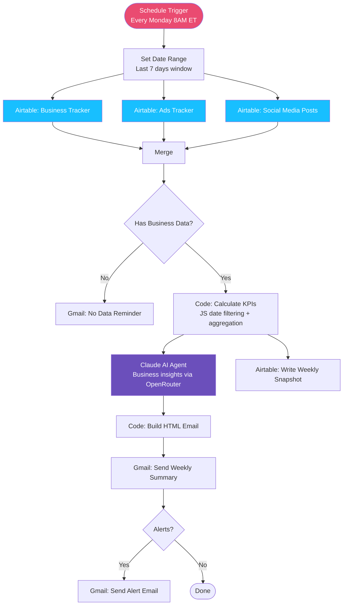

# Weekly KPI Summary — Hackensack Wellness Practice

> **A fully automated weekly business intelligence report for a solo acupuncture practice — pulls data from Airtable, calculates KPIs, generates AI insights, and delivers a branded HTML email every Monday morning. Zero manual effort.**

---

## Overview

This workflow runs every Monday at 8 AM Eastern and delivers the practice owner a complete picture of her business for the past 7 days — revenue, clients, hours, ad spend, and social media activity — with week-over-week comparisons, AI-written insights, and automatic alerts when something needs attention.

All data lives in her existing Airtable base. No new tools, no dashboards to log into. The report arrives in her inbox.

---

## Use Case

**Who uses this?**
Solo health and wellness practitioners who track their business data in Airtable and want automated reporting without hiring an analyst or building a dashboard.

**Problem it solves:**
Solo practitioners spend time manually pulling numbers from spreadsheets, calculating week-over-week changes, and trying to spot trends — time that should be spent with clients. Most give up and fly blind.

**Result:**
Every Monday, the practice owner opens her inbox to a full business summary: revenue vs. last week, clients seen, revenue per hour, ad spend by channel, social posts by platform, AI-generated insights specific to her numbers, and flagged alerts if anything looks off.

---

## System Architecture

---

## Key Features

### Parallel Airtable Fetching
All three Airtable tables (Business Tracker, Ads Tracker, Social Media Posts) are fetched simultaneously — not sequentially — cutting data retrieval time significantly. A Merge node synchronises the branches before processing continues.

### JavaScript Date Filtering
Rather than relying on Airtable filter formulas, all date-range filtering is handled in a JavaScript Code node. Records are filtered into two windows — last 7 days and the previous 7 days — enabling week-over-week comparisons without multiple API calls per table.

### AI-Generated Insights
KPI data is passed to a Claude Sonnet model via OpenRouter. The AI produces 3–5 specific, actionable business insights tailored to that week's exact numbers — not generic advice. Each insight is tagged as positive, neutral, or warning.

### Branded HTML Email
A Code node builds a fully styled HTML email with:
- KPI summary cards (revenue, clients, hours worked + revenue/hr)
- Week-over-week change indicators with colour-coded arrows
- AI insight cards with visual type indicators
- Breakdown tables: payment method, appointment type, session type, ad channel, social platform

### Smart Alerting
The workflow automatically flags and emails alerts for:
- Revenue drop > 20% vs prior week
- No clients logged (possible data entry gap)
- Ad spend with zero clients (tracking mismatch)
- Revenue per hour below the $50/hr benchmark

### Weekly Snapshot
Every run writes a summary record to a `Weekly Snapshots` Airtable table — building a historical record of the practice's performance over time.

---

## Workflow Nodes

| Node | Purpose |
|---|---|
| Schedule Trigger | Fires every Monday at 8:00 AM ET |
| Set Date Range | Computes last 7 days and prior 7 days window |
| Airtable: Business Last Week | Fetches Business Tracker records (last 100, sorted desc) |
| Airtable: Ads Tracker | Fetches ad spend records in parallel |
| Airtable: Social Media Posts | Fetches social post records in parallel |
| Merge | Synchronises the 3 parallel branches |
| IF: Has Business Data | Guards against empty data weeks |
| Gmail: No Data Reminder | Notifies if no appointments were logged |
| Code: Calculate KPIs | Filters by date, aggregates all KPIs, generates alerts |
| Claude AI Agent | Produces AI business insights (OpenRouter / Claude Sonnet) |
| Airtable: Write Weekly Snapshots | Persists weekly summary to Airtable |
| Code: Build HTML Email | Renders branded HTML email from KPI data + insights |
| Gmail: Send Weekly Summary | Delivers the report to the inbox |
| IF: Check Alerts | Checks whether any alerts were triggered |
| Gmail: Send Alert Email | Sends plain-text alert if needed |
| Error Trigger | Catches workflow-level failures |
| Gmail: Error Notification | Notifies on unexpected errors |

---

## Tech Stack

| Tool | Role |
|---|---|
| n8n (self-hosted) | Workflow orchestration |
| Airtable | Data source (Business Tracker, Ads Tracker, Social Posts, Weekly Snapshots) |
| Claude Sonnet 4.6 via OpenRouter | AI business insights |
| Gmail OAuth2 | Email delivery |
| JavaScript (Code nodes) | KPI calculation, date filtering, HTML rendering |

---

## Setup

1. Import `workflows/weekly_kpi_workflow.json` into your n8n instance
2. Assign credentials:
   - **Airtable Personal Access Token** → all Airtable nodes
   - **Gmail OAuth2** → all Gmail nodes
   - **OpenRouter API key** → Sonnet 4.6 model node
3. Update Airtable base ID and table IDs to match your base
4. Update recipient email addresses in Gmail nodes
5. Activate the workflow

---

## Airtable Schema

The workflow expects three tables in the connected Airtable base:

**Business Tracker**
- `Date` (Date), `Money Collected` (Number), `Clients Seen` (Number), `Hours Worked` (Number), `Payment Method` (Single select), `Appointment Type` (Single select), `Session Type` (Single select)

**Ads Tracker**
- `Date` (Date), `Amount Spent` (Number), `Channel` (Single/Multi select), `Notes` (Text)

**Social Media Posts**
- `Date Posted` (Date), `Platform` (Single select), `Number of posts` (Number), `Post Title` (Text)

**Weekly Snapshots** *(written to by the workflow)*
- `Week Of` (Date), `Revenue` (Number), `Clients Seen` (Number), `Hours Worked` (Number), `Ad Spend` (Number), `Posts` (Number)
