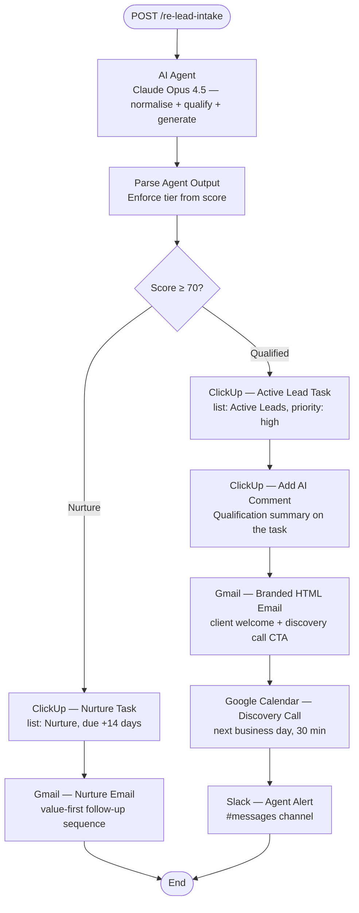
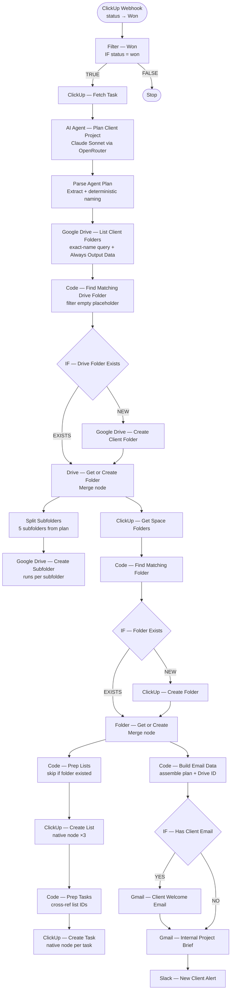

# Real Estate — Lead-to-Close Automation


> **Two-workflow n8n automation system that takes a real estate lead from first contact to fully provisioned client project — AI qualification, CRM routing, calendar booking, Drive folders, ClickUp tasks, branded emails, and Slack alerts — in under 60 seconds per stage, with no human in the loop.**

---

## Overview

This is a two-workflow pipeline for independent real estate agents:

| Workflow | Trigger | What it does |
|----------|---------|-------------|
| **W1 — Lead Intake & Qualification** | Inbound POST webhook | Scores the lead with AI, routes to Active Leads or Nurture in ClickUp, sends a branded email, books a discovery call in Google Calendar (qualified leads), and alerts the agent on Slack |
| **W2 — Transaction Launch** | ClickUp status → Won | Fires an AI planning agent to generate the full client project, then executes it across Google Drive, ClickUp, Gmail, and Slack in under 60 seconds |

Together they cover the full lifecycle — from the moment a lead submits an inquiry form to the moment a deal closes and the client project is live.

---

## System Architecture

### W1 — Lead Intake & Qualification (11 nodes)



**AI Agent details:**
- Model: Claude Opus 4.5 via OpenRouter (temperature 0.2)
- Single agent handles all three jobs: normalise raw form data → qualify with score → generate all output content
- Score ≥ 70 → Qualified tier; < 70 → Nurture tier
- Output: structured JSON with `tier`, `score`, `qualificationReason`, `clientEmail`, `followUpEmail` (full HTML body), `slackMessage`, `calendarTitle`, `calendarDescription`, `clickupTaskName`, `clickupTaskDescription`
- `Parse Agent Output` enforces tier strictly from score (overrides AI free-form tier if inconsistent) and appends `[AGENT_FOLLOWUP]` marker to qualified email body

### W2 — Transaction Launch (27 nodes)



**AI Agent details:**
- Model: Claude Sonnet 4.5 via OpenRouter
- Input: full ClickUp task JSON (name, description, custom fields, assignees)
- Output: structured JSON plan — `driveFolderName`, `driveSubfolders` (5 names), `clickupBoardName`, `checklist` (3 sections with `listName` and `tasks[]`), `client` (fullName, company, email, phone), `project` (type, startMs), `welcomeEmail`, `internalBrief`, `slackMessage`

---

## Key Features

### AI Qualification Engine (W1)
A single Claude Opus 4.5 agent normalises raw inbound data, scores the lead 0–100 against a rubric (budget fit, timeline, property type, motivation signals), and generates all downstream content in one call — task name, email body, Slack message, calendar details. Score threshold is enforced deterministically in the Parse node, not left to LLM judgement.

### AI Project Planning (W2)
Claude Sonnet receives the full ClickUp task and generates a complete, execution-ready project plan: Drive folder structure (client folder + 5 subfolders), ClickUp board (3 lists with tasks, due dates, and priorities), branded client welcome email, internal project brief with Drive link, and Slack notification.

### Deterministic Folder Naming (W2)
The AI's free-form folder name output varies between runs. `Parse Agent Plan` overrides it with a name constructed from the AI's structured extraction fields: `client.fullName — client.company — project.type`. These are consistent extractions, not free-form generation — ensuring the exact-name Drive search always finds the correct existing folder.

### Full Idempotency (W2)
Re-running the workflow for the same client produces no duplicates:
- **Drive**: `Always Output Data` on the List node + `.filter(item => item.json.id)` in Code — empty placeholder never reaches the IF node
- **ClickUp lists/tasks**: `Code — Prep Lists` returns `[]` if folder already existed (`exists === true`) — entire seeding chain stops cleanly
- **ClickUp folder**: `IF — Folder Exists` routes around the Create node when folder is present

### Missing Email Guard (W2)
`IF — Has Client Email` checks `$json.client.email` before the client email node. The FALSE branch connects directly to `Gmail — Internal Project Brief` — internal brief and Slack always fire even when the client address was not found.

### Parallel Execution (W2)
After the Drive folder merge node, two branches run simultaneously: subfolder creation (5 subfolders) and the ClickUp project board setup. After the ClickUp folder merge, the email chain runs in parallel with task seeding.

### Branded HTML Throughout
Both workflows use consistent HTML email templates (dark navy header, white body, purple accent, grey footer). W2's internal brief includes a clickable Google Drive folder link.

---

## Workflow Breakdown

### W1 Node Summary

| Phase | Nodes | What happens |
|-------|-------|-------------|
| **Trigger** | Webhook | Receives JSON from any lead capture form or CRM |
| **AI** | AI Agent + OpenRouter | Claude Opus 4.5 normalises, qualifies, and generates all output content |
| **Routing** | Parse Agent Output | Enforces tier from numeric score; appends markers for downstream logic |
| **Qualified path** | ClickUp Task + Comment + Gmail + Calendar + Slack | High-priority Active Lead task, AI summary comment, branded email, 30-min discovery call next day, agent alert |
| **Nurture path** | ClickUp Task + Gmail | Normal-priority Nurture task due +14 days, value-first follow-up email |

### W2 Node Summary

| Phase | Nodes | What happens |
|-------|-------|-------------|
| **Trigger** | ClickUp Webhook → Filter | Receives all status changes; IF filters to `won` only |
| **Data** | ClickUp Fetch Task | Pulls full task JSON including custom fields, assignees, description |
| **AI Planning** | AI Agent + OpenRouter + Parse | Claude Sonnet generates the full project plan as structured JSON; Code node overrides folder name with deterministic version |
| **Drive** | Find → IF → Create/Reuse → Split → Subfolder | Searches Drive by exact name, creates client folder only if missing, fans out to 5 subfolders in parallel |
| **ClickUp** | Get Folders → Find → IF → Create/Reuse → Lists → Tasks | Checks for existing board, creates if new, seeds 3 lists and all tasks with due dates and priorities |
| **Comms** | Build Email Data → IF Email → Client Email → Internal Brief → Slack | Guards against missing email; internal brief and Slack always fire |

---

## Tech Stack

| Tool | Role |
|------|------|
| **n8n** | Workflow orchestration — webhook ingestion, conditional routing, parallel fan-out, native app nodes |
| **Claude Opus 4.5** | W1 AI Agent — lead normalisation, scoring, and content generation |
| **Claude Sonnet 4.5** | W2 AI Agent — project plan generation, email drafting, task structuring |
| **OpenRouter** | LLM gateway for both workflows |
| **ClickUp** | CRM trigger source + project board destination (tasks, lists, folders, comments) |
| **Google Drive** | Client folder and subfolder creation with idempotency |
| **Google Calendar** | Discovery call booking for qualified leads (W1) |
| **Gmail** | Branded HTML emails — lead follow-up (W1) + client welcome + internal brief (W2) |
| **Slack** | Agent alerts — new qualified lead (W1) + new client project (W2) |

---

## Engineering Challenges Solved

### n8n 2.4.6 Task Runner Sandbox
n8n 2.4.6 with `N8N_RUNNERS_ENABLED=true` runs Code nodes in an isolated VM — `fetch`, `$helpers.httpRequest`, and `$item()` are all unavailable. Replaced all HTTP-in-Code patterns with native ClickUp nodes (`ClickUp — Create List`, `ClickUp — Create Task`) chained via a cross-reference Code node. Replaced `$('Node').$item(i)` with `$('Node').all()[i]`.

### AI Non-Determinism → Duplicate Drive Folders
LLM generates different free-form folder names between runs for the same client ("Sharon Magomero — TechMove Inc — Commercial Tenant Rep" vs "…Representation"). The exact-name Drive search missed the existing folder and created a duplicate. Fixed: `Parse Agent Plan` overrides the AI's free-form `driveFolderName` with a name constructed from structured extracted fields (`client.fullName — client.company — project.type`).

### n8n Execution Stops on 0 Items
When no Drive folder exists on first run, the Drive search returns 0 items and n8n stops execution by default. Fixed with `Always Output Data: true` on the List node, plus `.filter(item => item.json.id)` in the downstream Code node — the empty placeholder never propagates past the filter, so `exists: false` routes correctly to the create path.

### IF Branch Wiring Bug
The original workflow had both IF outputs wired to `main[0]` (the TRUE branch), causing both "use existing" and "create new" to run simultaneously on re-runs — ClickUp "Folder name taken" errors and Drive duplicates. Fixed by explicitly wiring `output[0] → merge` (existing) and `output[1] → create` (new).

### Google Drive `__rl` Name Format
The Google Drive node's `name` field was stored as a Resource Locator object (`__rl: true`). The `__rl` format is for IDs, not string names — Drive silently fell back to "New Folder" for every created folder. Fixed by changing `name` to a plain expression string.

### Slack `no_text` Error
The Slack node's message expression referenced `$json.slackMessage`, but by that point `$json` held Gmail's send response (`{id, threadId, labelIds}`). Fixed by referencing `$('Code — Build Email Data').first().json.slackMessage` directly.

---

## Setup Instructions

> **Prerequisites:** n8n self-hosted (tested on 2.4.6), ClickUp workspace with webhook permissions, Google Drive root folder, Google Calendar OAuth2, Gmail OAuth2, Slack bot in your channel, OpenRouter API key.

### 1. Import both workflows

Import via n8n → Workflows → Import from file:
- `Real Estate — Lead Intake & Qualification.json`
- `Real Estate — Transaction Launch.json`

### 2. Configure credentials

| Credential | Type | Used by |
|-----------|------|---------|
| ClickUp account | ClickUp API | Both workflows |
| OpenRouter account | OpenRouter API | Both workflows |
| Google Drive account | Google OAuth2 | W2 |
| Google Calendar account | Google OAuth2 | W1 |
| Gmail account | Google OAuth2 | Both workflows |
| Slack account | Slack OAuth2 / Bot | Both workflows |

### 3. Update hardcoded values

**W1 — Lead Intake & Qualification:**

| Value | What it is | Where |
|-------|------------|-------|
| `901522903678` | ClickUp Active Leads list ID | ClickUp — Active Lead Task node |
| `901522903680` | ClickUp Nurture list ID | ClickUp — Nurture Task node |
| `#messages` | Slack channel name | Slack node |
| Agent email | Internal calendar invite attendee | Google Calendar node |

**W2 — Transaction Launch:**

| Value | What it is | Where |
|-------|------------|-------|
| `1tx3s2G5sngPiu-xj6PgktzNjv3fDhHqS` | Google Drive parent folder ID | Drive List + Create nodes |
| `90152521719` | ClickUp workspace/team ID | ClickUp folder/list/task nodes |
| `901510813161` | ClickUp space ID | ClickUp folder/list/task nodes |
| `#messages` | Slack channel name | Slack node |
| `evancechapuma62@gmail.com` | Internal brief recipient | Gmail Internal Brief node |

### 4. Register the ClickUp webhook (W2)

```bash
curl -X POST "https://api.clickup.com/api/v2/team/YOUR_WORKSPACE_ID/webhook" \
  -H "Authorization: YOUR_CLICKUP_TOKEN" \
  -H "Content-Type: application/json" \
  -d '{
    "endpoint": "https://YOUR_N8N_URL/webhook/clickup-status-change",
    "events": ["taskStatusUpdated"],
    "space_id": "YOUR_SPACE_ID"
  }'
```

### 5. Test W1 — Lead Intake

```
POST https://YOUR_N8N_URL/webhook/re-lead-intake
Content-Type: application/json
```

**Qualified lead (score ≥ 70):**
```json
{
  "name": "Marcus Webb",
  "email": "marcus.webb@nexusproperties.com",
  "phone": "+1 312 555 0182",
  "company": "Nexus Properties LLC",
  "budget": "$1,200,000",
  "propertyType": "Commercial Office",
  "timeline": "60 days",
  "message": "We need to relocate our HQ. Ready to move fast, financing is pre-approved."
}
```

**Expected result:** ClickUp Active Lead task (high priority) + AI comment → branded email sent → Google Calendar discovery call booked for next business day → Slack agent alert.

**Nurture lead (score < 70):**
```json
{
  "name": "Jordan Mills",
  "email": "jordan@email.com",
  "phone": "+1 555 000 1234",
  "budget": "Not sure yet",
  "propertyType": "Residential",
  "timeline": "Maybe next year",
  "message": "Just browsing, not in a hurry."
}
```

**Expected result:** ClickUp Nurture task (normal priority, due +14 days) → nurture email sent.

### 6. Test W2 — Transaction Launch

```
POST https://YOUR_N8N_URL/webhook/clickup-status-change
Content-Type: application/json
```

```json
{
  "event": "taskStatusUpdated",
  "task_id": "YOUR_TASK_ID",
  "webhook_id": "test-001",
  "history_items": [
    {
      "id": "hist_001",
      "type": 2,
      "date": "1745280000000",
      "field": "status",
      "parent_id": "list_id",
      "data": {},
      "source": null,
      "user": {
        "id": 99999999,
        "username": "agent",
        "email": "agent@brokerage.com",
        "profilePicture": null
      },
      "before": {
        "status": "in progress",
        "color": "#4194f6",
        "type": "custom",
        "orderindex": 1
      },
      "after": {
        "status": "won",
        "color": "#6bc950",
        "type": "custom",
        "orderindex": 2
      }
    }
  ]
}
```

The task referenced by `task_id` should have client details in its description:

```
Client: [Full Name]
Company: [Company Name]
Email: [client@email.com]
Phone: [+1 555 000 0000]
Budget: $750,000
Requirements: [Project requirements]
```

**Expected result (first run):** Drive client folder + 5 subfolders → ClickUp board + 3 lists + tasks → client email (if address found) + internal brief + Slack alert.

**Expected result (re-run):** Drive folder found, no duplicate. ClickUp folder found, no new lists/tasks. Emails and Slack still fire.

---

## Key Design Decisions

**Why is the W1 AI agent a single call instead of a chain?**
The lead qualification input is small and self-contained — all three jobs (normalise, score, generate) depend on the same raw data. A single structured-output call is faster, cheaper, and has fewer failure points than a three-step chain. The Parse node adds determinism for the parts that matter (tier enforcement from score).

**Why Claude Opus for W1 and Sonnet for W2?**
W1 qualification accuracy directly determines whether the agent follows up with the right leads — a misjudged score means a lost deal. Opus 4.5's stronger reasoning was chosen here. W2 is a structured content generation task where Sonnet 4.5 performs reliably at lower cost.

**Why is `driveFolderName` overridden in `Parse Agent Plan` (W2)?**
The AI generates a free-form folder name from unstructured task text. Between runs it may output "Sharon Magomero — TechMove Inc — Commercial Tenant Rep" vs "…Representation" — causing the exact-name Drive search to miss the existing folder and create a duplicate. The Code node overrides the AI's free-form output with a deterministic name built from structured fields the AI extracts consistently: `client.fullName — client.company — project.type`.

**Why `Always Output Data` on the Drive List node (W2)?**
When the client folder does not yet exist, the Drive search returns 0 items and n8n stops execution by default. `Always Output Data` outputs a single empty `{}` item, letting execution continue. The downstream Code node filters with `.filter(item => item.json.id)` — a real folder has an `id`; the empty placeholder does not. Folder found = `exists: true`. Folder missing = `exists: false`. No fake data ever reaches the IF node.

**Why native ClickUp nodes instead of HTTP requests in Code (W2)?**
n8n 2.4.6 with the external task runner enabled runs Code nodes in an isolated sandbox — `fetch` and `$helpers.httpRequest` are both unavailable. Native ClickUp nodes use n8n's credential management, keeping tokens out of the workflow JSON entirely.

**Why does `Code — Prep Lists` return `[]` when the folder already existed (W2)?**
If the ClickUp folder was found (not created), its lists already exist from a previous run. Returning `[]` stops the downstream Create List → Prep Tasks → Create Task chain cleanly, preventing "List name taken" errors on re-runs.

---

## Possible Extensions

- **Zapier/Make integration**: Expose the W1 webhook as a trigger so it can receive leads from any no-code lead capture tool
- **Multi-tier routing**: Add Hot tier (score ≥ 90) with immediate Vapi phone call, alongside the current Qualified/Nurture binary
- **Calendar milestone creation**: W2 could create Google Calendar events for inspection, appraisal, and closing date from the AI plan's `project.startMs`
- **ClickUp task Drive links**: After subfolder creation, post the Drive folder URL as a comment on the original ClickUp task
- **PDF contract generation**: Google Docs template merge to generate a signed engagement letter automatically
- **DocuSign routing**: Route the generated contract to DocuSign for e-signature before the client welcome email fires
- **SMS notifications**: Twilio node alongside Slack alerts for both workflows

---

## License

MIT — see [LICENSE](../../LICENSE) for details.

---

*Built by [Evance Chapuma](https://www.upwork.com/freelancers/evancechapuma) — AI Automation Specialist*
