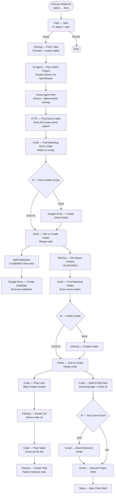

# Real Estate — Transaction Launch Automation


> **When a real estate deal is marked Won in ClickUp, this 27-node workflow fires an AI agent to build the entire client project — Drive folders, ClickUp lists and tasks, a branded welcome email, an internal brief, and a Slack alert — in under 60 seconds, with full idempotency on re-runs.**

---

## Overview

This is the Transaction Launch workflow in a two-part real estate automation system. It triggers the moment a CRM deal status changes to **Won**, fetches the full task from ClickUp, hands it to a Claude AI agent to generate a complete client project plan, then executes that plan across Google Drive, ClickUp, Gmail, and Slack — in parallel where possible.

The workflow handles every edge case a production system encounters: existing clients re-entering the pipeline, missing contact information, AI-generated names varying between runs, and n8n's external task runner sandbox restrictions.

---

## Use Case

**Who uses this?**
Independent real estate agents and small brokerages managing deals in ClickUp.

**Problem it solves:**
When a deal closes, an agent must manually: create a Google Drive folder with 5 subfolders, set up a ClickUp project board with lists and tasks, email the client, brief the internal team, and alert the channel. This takes 20–40 minutes per client and is error-prone under pressure.

**Result:**
The entire client onboarding sequence executes automatically — Drive folder and subfolders created with proper names, ClickUp project board seeded with 3 lists and all tasks, client welcome email sent, internal project brief delivered with Drive link, Slack notification posted. The agent opens their laptop to find everything already done.

---

## System Architecture



---

## Workflow Breakdown

| Phase | Nodes | What happens |
|-------|-------|-------------|
| **Trigger** | ClickUp Webhook → Filter | Receives all ClickUp status changes; IF filters to `won` only |
| **Data** | ClickUp Fetch Task | Pulls full task JSON including custom fields, assignees, description |
| **AI Planning** | AI Agent + OpenRouter + Parse | Claude Sonnet generates the full project plan as structured JSON; Code node extracts it and overrides the folder name with a deterministic version from structured fields |
| **Drive** | Find → IF → Create/Reuse → Split → Subfolder | Searches Drive by exact name, creates client folder only if missing, then fans out to create 5 subfolders in parallel |
| **ClickUp** | Get Folders → Find → IF → Create/Reuse → Lists → Tasks | Checks for existing project folder, creates it if new, seeds 3 lists (Discovery & Scoping, Delivery, Review & Handoff) and all tasks with due dates and priorities |
| **Comms** | Build Email Data → IF Email → Client Email → Internal Brief → Slack | Guards against missing email; client email fires only when address exists; internal brief and Slack always fire |

---

## Tech Stack

| Tool | Role |
|------|------|
| **n8n** | Workflow orchestration — 27 nodes, webhook ingestion, native app nodes |
| **Claude Sonnet 4.5** | AI Agent — project plan generation, email drafting, task structuring |
| **OpenRouter** | LLM gateway routing to Claude |
| **ClickUp** | CRM trigger source + project board destination |
| **Google Drive** | Client folder and subfolder creation with idempotency |
| **Gmail** | Branded HTML client welcome email + internal project brief |
| **Slack** | Team alert with Drive link injected into message |

---

## Key Features

### AI-Generated Project Plans
Claude receives the full ClickUp task — name, description, custom fields, assignees — and generates a complete structured JSON plan: folder names, subfolder list, 3-section checklist with tasks (name, due date, priority, description), client email subject and body, internal brief, and Slack message. The agent uses the task's custom fields to infer client type, budget, and requirements even when they're missing from structured fields.

### Deterministic Folder Naming
The AI's free-form `driveFolderName` output varies between runs for the same client. The `Parse Agent Plan` node overrides it with a name built from the AI's structured extraction fields: `client.fullName — client.company — project.type`. These are factual extractions, not free-form generation, making them consistent. The Drive search uses the exact name in the API query — returning 0 or 1 results — eliminating false positives.

### Full Idempotency
Re-running the workflow for the same client produces no duplicates:
- **Drive**: `Google Drive — List Client Folders` has `Always Output Data` enabled; the downstream Code node filters out the empty placeholder with `.filter(item => item.json.id)` — real folder found = `exists: true`, placeholder = filtered out = `exists: false`
- **ClickUp lists**: `Code — Prep Lists` checks if the ClickUp folder already existed (`exists === true`) and returns `[]` if so — the list and task creation chain stops cleanly
- **ClickUp folder**: `IF — Folder Exists` routes around the Create node when the folder is already present

### Parallel Execution
After `Drive — Get or Create Folder`, the workflow fans out to two independent branches simultaneously:
- Drive subfolder creation (5 subfolders, one per split item)
- ClickUp project board setup (folder → lists → tasks)

After `Folder — Get or Create`, the email chain runs in parallel with task creation — the client email doesn't wait for all tasks to be seeded.

### Missing Email Guard
The AI flags missing contact information in the internal brief but the workflow can't crash trying to send to an empty address. An `IF — Has Client Email` node checks `$json.client.email` before the client email node. The FALSE branch connects directly to `Gmail — Internal Project Brief` — so the internal team always gets the brief and Slack always fires, regardless of whether a client email exists.

### Branded HTML Emails
Both emails use full HTML templates — dark navy header, white body, purple accent, grey footer. The internal brief includes a clickable Google Drive folder link rendered from `driveFolderId`.

---

## Engineering Challenges Solved

### IF Branch Wiring Bug
The original workflow had both `IF — Drive Folder Exists` outputs wired to `main[0]` (the TRUE branch). The FALSE branch had no connection. Effect: when a folder was found, BOTH "use existing" and "create new" ran simultaneously — causing ClickUp "Folder name taken" errors and Drive duplicates. Fixed by explicitly wiring `output[0] → merge` and `output[1] → create`.

### n8n 2.4.6 Task Runner Sandbox
n8n 2.4.6 with `N8N_RUNNERS_ENABLED=true` runs Code nodes in an isolated VM sandbox with no HTTP access — `fetch`, `$helpers.httpRequest`, and `$helpers` are all unavailable. The original `Seed Project Lists & Tasks` Code node used `fetch()` to call the ClickUp API in a loop, causing `fetch is not defined` errors. Replaced with native ClickUp nodes (`ClickUp — Create List` and `ClickUp — Create Task`) chained through a cross-reference Code node.

### `$item()` Not Available in Task Runner
The cross-reference Code node (`Code — Prep Tasks`) originally used `$('Code — Prep Lists').$item(i)` to pair list IDs with their tasks. `$item()` is not exposed in the external task runner. Replaced with `$('Code — Prep Lists').all()[i]` — standard array access, available everywhere.

### Google Drive `__rl` Name Format
The Google Drive node's `name` field for folder creation was stored as a Resource Locator object `{ __rl: true, value: "={{ $json.folderName }}", mode: "expression" }`. The `__rl` format is intended for IDs and references, not string names — Drive silently fell back to "New Folder" for every created folder. Fixed by changing `name` to a plain expression string `"={{ $json.folderName }}"`.

### Slack `no_text` Error
The Slack node's message expression referenced `$json.slackMessage` — but by that point `$json` held Gmail's send response (`{id, threadId, labelIds}`), not the plan data. Fixed by referencing `$('Code — Build Email Data').first().json.slackMessage` directly.

---

## Setup Instructions

> **Prerequisites:** n8n self-hosted (tested on 2.4.6), ClickUp workspace with webhook permissions, Google Drive root folder, Gmail OAuth2, Slack bot in your channel, OpenRouter API key.

### 1. Import the workflow

Import `Real Estate — Transaction Launch.json` via n8n → Workflows → Import from file.

### 2. Configure credentials

| Credential | Type | Node(s) |
|-----------|------|---------|
| ClickUp account | ClickUp API | Fetch Task, Get Space Folders, Create Folder, Create List, Create Task |
| OpenRouter account | OpenRouter API | OpenRouter — Project Model |
| Google Drive account | Google OAuth2 | List Client Folders, Create Client Folder, Create Subfolder |
| Gmail account | Google OAuth2 | Client Welcome Email, Internal Project Brief |
| Slack account | Slack OAuth2 / Bot | New Client Alert |

### 3. Update hardcoded values

Search the workflow JSON for these values and replace:

| Value | What it is | Where |
|-------|------------|-------|
| `1tx3s2G5sngPiu-xj6PgktzNjv3fDhHqS` | Google Drive parent folder ID | Drive List + Create nodes |
| `90152521719` | ClickUp workspace/team ID | ClickUp folder/list/task nodes |
| `901510813161` | ClickUp space ID | ClickUp folder/list/task nodes |
| `#messages` | Slack channel name | Slack node |
| `evancechapuma62@gmail.com` | Internal brief recipient | Gmail Internal Brief node |

### 4. Register the ClickUp webhook

```bash
curl -X POST "https://api.clickup.com/api/v2/team/YOUR_WORKSPACE_ID/webhook" \
  -H "Authorization: YOUR_CLICKUP_TOKEN" \
  -H "Content-Type: application/json" \
  -d '{
    "endpoint": "https://YOUR_N8N_URL/webhook/clickup-status-change",
    "events": ["taskStatusUpdated"],
    "space_id": "YOUR_SPACE_ID"
  }'
```

### 5. Create a test task in ClickUp

Create a task in your space with client details in the description:

```
Client: [Full Name]
Company: [Company Name]
Email: [client@email.com]
Phone: [+1 555 000 0000]
Budget: $750,000
Requirements: [Project requirements]
```

### 6. Test with Postman

```
POST https://YOUR_N8N_URL/webhook/clickup-status-change
Content-Type: application/json
```

```json
{
  "event": "taskStatusUpdated",
  "task_id": "YOUR_TASK_ID",
  "webhook_id": "test-001",
  "history_items": [
    {
      "id": "hist_001",
      "type": 2,
      "date": "1745280000000",
      "field": "status",
      "parent_id": "list_id",
      "data": {},
      "source": null,
      "user": {
        "id": 99999999,
        "username": "agent",
        "email": "agent@brokerage.com",
        "profilePicture": null
      },
      "before": {
        "status": "in progress",
        "color": "#4194f6",
        "type": "custom",
        "orderindex": 1
      },
      "after": {
        "status": "won",
        "color": "#6bc950",
        "type": "custom",
        "orderindex": 2
      }
    }
  ]
}
```

**Expected result (first run):**
- Google Drive: client folder created with deterministic name, 5 subfolders created
- ClickUp: project folder created, 3 lists created, tasks seeded with due dates
- Gmail: client welcome email sent (if email exists), internal brief sent with Drive link
- Slack: team alert posted with Drive link

**Expected result (re-run, same task):**
- Drive folder found → no duplicate created
- ClickUp folder found → lists and tasks skipped
- Emails and Slack still fire

---

## Environment Variables

No n8n environment variables are required. All authentication is handled through n8n credentials. The following values are hardcoded in the workflow nodes and should be updated directly:

| Setting | Location |
|---------|----------|
| Drive parent folder ID | `Google Drive — List Client Folders` queryString, `Google Drive — Create Client Folder` folderId |
| ClickUp team/space IDs | All ClickUp nodes |
| Slack channel | `Slack — New Client Alert` |
| Internal email address | `Gmail — Internal Project Brief` sendTo |

---

## Key Design Decisions

**Why is `driveFolderName` overridden in `Parse Agent Plan`?**
The AI generates a free-form folder name from unstructured task text. Between runs, it may output "Sharon Magomero — TechMove Inc — Commercial Tenant Rep" vs "Sharon Magomero — TechMove Inc — Commercial Tenant Representation" — causing the exact-name Drive search to miss the existing folder and create a duplicate. The Code node overrides the AI's free-form output with a deterministic name built from structured fields the AI extracts consistently: `client.fullName — client.company — project.type`.

**Why `Always Output Data` on the Drive List node?**
When the client folder does not yet exist, the Drive search returns 0 items and n8n stops execution by default. `Always Output Data` outputs a single empty `{}` item, letting execution continue to `Code — Find Matching Drive Folder`. The Code node filters with `.filter(item => item.json.id)` — the real folder has an `id`; the empty placeholder does not. Folder found = 1 real item = `exists: true`. Folder missing = 0 real items = `exists: false`. No fake data ever reaches the IF node.

**Why native ClickUp nodes instead of HTTP Request or Code-based HTTP for list/task creation?**
n8n 2.4.6 with the external task runner enabled runs Code nodes in an isolated sandbox — `fetch` and `$helpers.httpRequest` are both unavailable. HTTP Request nodes work but hardcode the API token. Native ClickUp nodes use n8n's credential management, keeping tokens out of the workflow JSON entirely.

**Why does `Code — Prep Lists` check `exists === true` before generating list items?**
If the ClickUp folder was found (not created), its lists already exist from a previous run. Returning `[]` stops the downstream `ClickUp — Create List` → `Code — Prep Tasks` → `ClickUp — Create Task` chain cleanly. The parallel email branch (`Code — Build Email Data`) is unaffected and always runs.

**Why does the FALSE branch of `IF — Has Client Email` connect to `Gmail — Internal Project Brief` instead of stopping?**
The internal brief and Slack notification must always fire — even when the client's email address was not found. The FALSE path bypasses the client email and connects directly to the internal brief. The agent always gets the project brief with the Drive link; the client email is simply skipped.

---

## Possible Extensions

- **Workflow 1 — Lead Intake**: Add the upstream lead qualification workflow (Claude-scored, ClickUp task created) so this workflow triggers from AI-qualified leads rather than manual status changes
- **Calendar milestone creation**: Use Google Calendar to create events for inspection due, appraisal due, and closing date — referenced from the AI plan's `project.startMs`
- **ClickUp task Drive links**: After subfolder creation, post the Drive folder URL as a comment on the original ClickUp task
- **PDF contract generation**: Add a Google Docs template merge to generate a signed engagement letter automatically
- **SMS notification**: Add a Twilio node alongside the Slack alert to send the agent an SMS for urgent deals
- **DocuSign**: Route the generated contract to DocuSign for e-signature before the welcome email fires

---

## License

MIT — see [LICENSE](../../LICENSE) for details.

---

*Built by [Evance Chapuma](https://www.upwork.com/freelancers/evancechapuma) — AI Automation Specialist*
